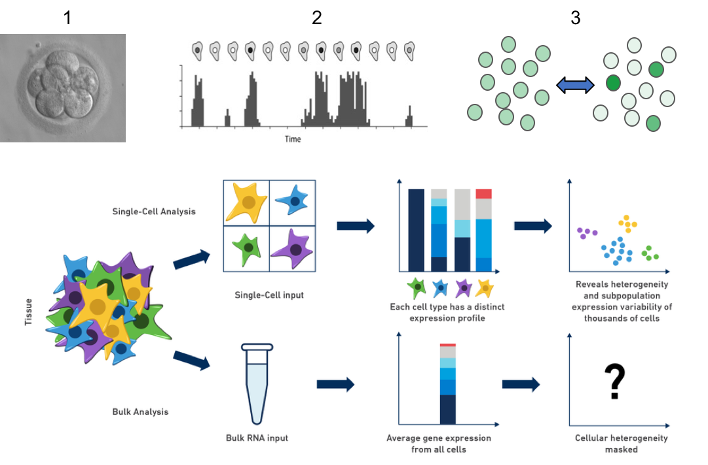
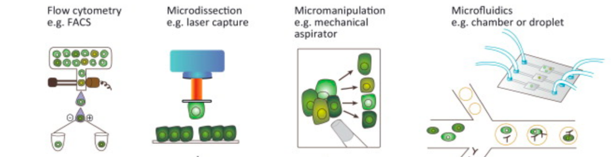
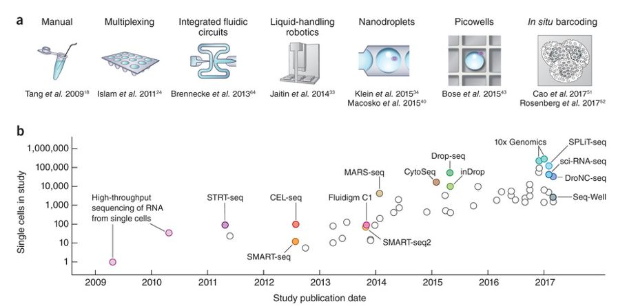
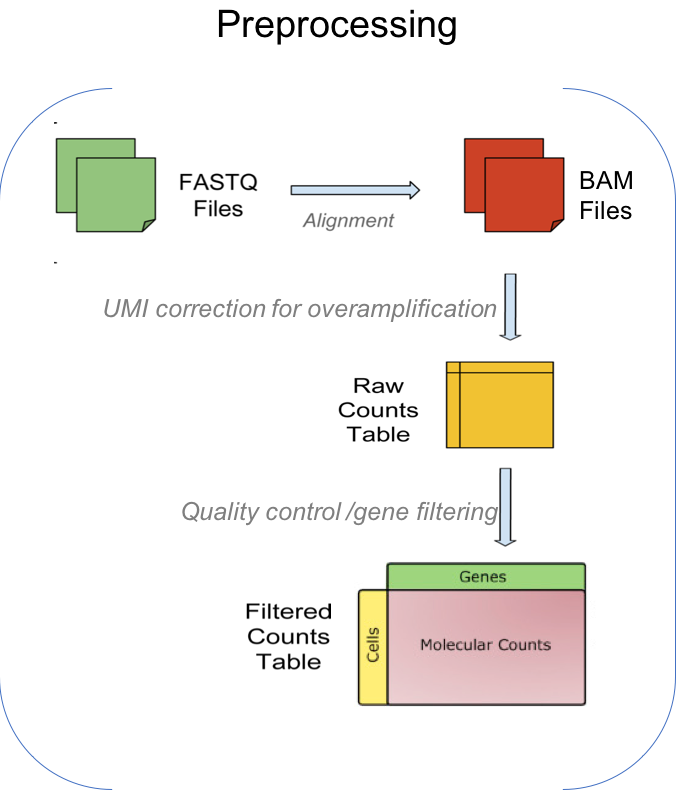
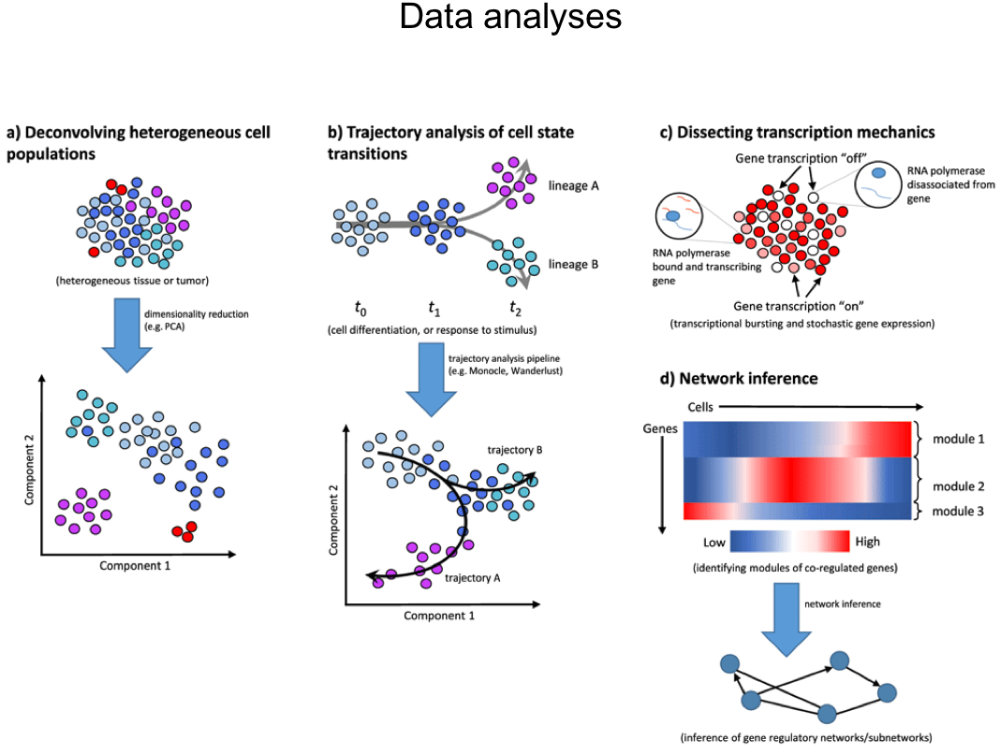
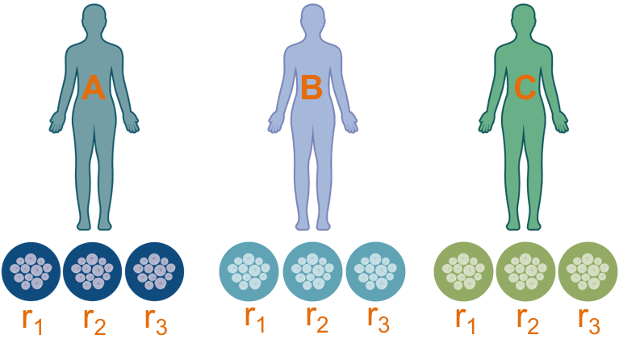
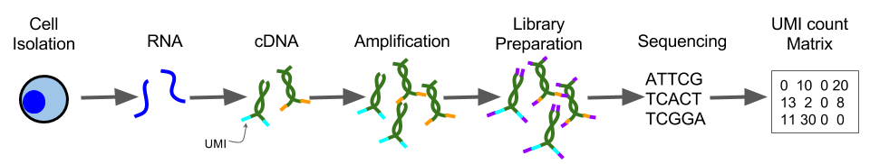
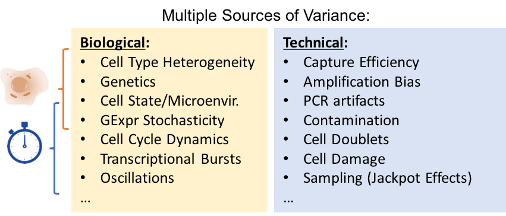
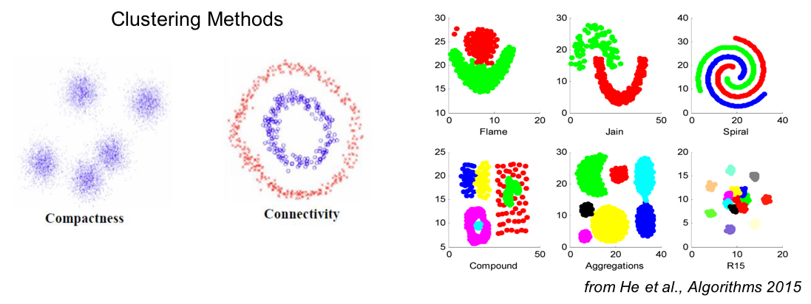
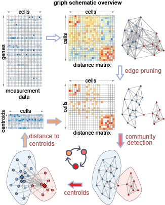

```{r setup, include=FALSE}
knitr::opts_chunk$set(echo = TRUE, message=FALSE, warning=FALSE)
```


# General info

**Course Material and code on github**
https://github.com/ppapasaikas/ECCB2018_SC


**Access to the FMI rstudio server**

## Login and navigate to tutorial directory
On your browser type: 

http://rstudio-ext.fmi.ch

After logging in with your credentials switch working directory by typing:

```{r Switch to tutorial directory, eval=FALSE}
#Absolute path to ECCB2018_SC repository in the the FMT ext machine
setwd("/home/radmin/ECCB2018_SC/") 
```

From here on you can run the turorial code by copying and pasting on your console.
Alternatively you could File -> File Open -> Tutorial.rmd and execute the code directly from the file.


# Single Cell Analysis Tutorial Part 1


## Why single cell sequencing?

1. Limited input material (e.g early development, circulating tumor cells...)
2. Study cell autonomous processes (Txn bursting, noise...)
3. Sample Heterogeneity (mixture of cell types / states) 
  + Number and frequency of cell types
  + Markers for cell types
  + Cell type relationships (developmental/pseudo-temporal ordering)

```{r, echo=FALSE, out.width = "500px"}

```


## Overview of experimental and computational workflow

**Experimental workflow**
Preparation of a SC RNA library typically involves:

1.  Cell dissociation
2.  Cell isolation (Microfuidics, Droplet based, Combinatorial labelling, FACS / Laser based / Micromanipulation)



Adapted from Beda and Schneider Trends Cell Biol. 2014 Nov;24(11):712-23.


3.  Amplification + Sequencing


* In the case of high-throughput isolation methods each cell is associated and identifiable via a **cell barcode**.
* In many (nowdays most) library preparation methods each read also contains a second barcode called **Unique Molecular Identifier (UMI)**.
  UMIs allow us to discriminate between reads coming from different original mRNAs of the same gene vs reads the were amplified during library preparation.


**Methods and Protocols**

The development of new methods and protocols for scRNA-seq is currently a very active area of research. The following image from Svensson et al, Nature 2018 shows several protocols published over the last few years.



Svensson et al, Nature 2018.

**Platform Choice**

In a recent study, Ziegenhain et al, Mol Cell 2017 compared different scRNAseq protocols on mouse embryonic stem cells (mESCs). The authors controlled the number of cells and the sequencing depth, thereby enabling them to directly compare the sensitivity, noise-levels and costs of the different protocols. One of the conclusions (image below) illustrates that, for a given detection threshold, the number of detected genes vary between different protocols.


Ziegenhain et al, Mol Cell 2017


**Computational workflow: Preprocessing**

The following image presents the typical preprocessing steps employed in scRNAseq data analyses.




**Computational workflow: Data Analyses**




## Example Dataset 

To illustrate the various aspects of SC analysis, we will use a 
[dataset](https://www.ncbi.nlm.nih.gov/pmc/articles/PMC5206706/) of induced pluripotent stem cells generated from three different individuals  (A, B and C) with three replicates of 96 cells each (A.r1, A.r2, A.r3, ...).


The data were generated in [Yoav Gilad](http://giladlab.uchicago.edu/)'s lab at the
University of Chicago. The experiments were carried out on the
Fluidigm C1 platform and to facilitate the quantification both unique
molecular identifiers (UMIs, see figure below) and ERCC _spike-ins_ were used. The data files are located in the `data/tung` folder in the [/home/radmin/ECCB2018_SC] directory .



Load the data and annotations:

```{r load_data}
PATH="/home/radmin/ECCB2018_SC/" #Abs Path to ECCB repo in the the ext-fmi machine
PATH=""
umi_counts=readRDS(file=paste(PATH, "data/tung/umi_counts.rds",sep=""))
read_counts=readRDS(file=paste(PATH, "data/tung/read_counts.rds",sep=""))
anno=readRDS(file=paste(PATH, "data/tung/annotation.rds",sep=""))
```

Inspect a small portion of the (umi-collapsed) expression matrix as well as the design of the experiment:

```{r small_output}
#Small portion of the expression matrix
head(umi_counts[ , 1:3])

#Summary of the experimental design (individual, replicate and batch):
summary(anno[,c(1,2,4)])
```

We also load some information on the ERCC loading concentration as well as gene symbol annotation for the endogenous genes (non-ERCC features) of our expression matrix:
```{r get_gene_annot, include=FALSE}
#library(biomaRt)
#ENS=getBM(attributes=c('ensembl_gene_id', 'hgnc_symbol'),filters='ensembl_gene_id',values=endog,mart=useEnsembl(biomart="ensembl", dataset="hsapiens_gene_ensembl") )
#rownames(ENS)=ENS[,1]
#ENS2HGNC=data.frame(ensembl_gene_id=endog, hgnc_symbol=ENS[endog,2],row.names=endog)
#ERCCdata <- read.table(paste(PATH, "data/ERCC_conc.txt",sep="") , sep = "\t",header=TRUE)
#ERCCconc <- as.matrix(ERCCdata[,4])
#dimnames(ERCCconc)=list(ERCCdata[,2],colnames(ERCCdata)[4])
```

```{r get_ERCC_and_gene_annot_info}
ERCC <- rownames(umi_counts)[(grepl("ERCC-", rownames(umi_counts)))]
endog <- setdiff (rownames(umi_counts),ERCC) #Endogenous genes are the set difference between all genes and ERCCs
ERCCconc=readRDS( file=paste(PATH, "data/tung/ERCCconc.rds",sep="")   ) #Loading concentrations of ERCCs
ENS2HGNC=readRDS( file=paste(PATH, "data/tung/ENS2HGNC.rds",sep="")   ) #Gene symbol annotation for the endogenous gene features
```


Finally we will also load a few packages and functions that will be used during the training:
```{r source_helper_functions, message=FALSE}
source(paste(PATH, "helper_functions.R",sep=""))
```


## Exaggerated dispersion of measurements


The most important characteristic of any SC RNAseq assay that sets them apart from bulk RNAseq is that measurements are subject to multiple, potent and often confounded sources of variance:




Some of the "effects" of this property can be evidenced in scatterplots of (umi-collapsed) gene counts between pairs of cells:


```{r cell2cell}
#Log transform the endogenous genes count data for two cells (with similar total umi_counts)
use.data=log2(umi_counts[endog ,c(76,669) ]+1) 

#A scatterplot of the gene counts for the two cells:
plot(use.data[,1], use.data[,2], pch='.', xlab="Cell A", ylab="Cell B",cex=3)

#mark drop-outs (undetected genes)
dropouts=which(apply(use.data,1,min)==0)
points( use.data[ dropouts,   ], col="DimGray",pch=19 )

#mark over-dispersed genes
overdisp=which( abs(use.data[,1]-use.data[,2])>1  &  apply(use.data,1,min) > 3 )
points( use.data[overdisp, ], col="orange",pch=19 )

#mark high-magnitude outliers
outliers=which( abs(use.data[,1]-use.data[,2])>4 )
points( use.data[outliers, ], col="red",pch=19 )

#Add a legend
legend( "bottomright", legend=c("Dropouts (undetected genes)","Overdispersed genes", "High magnitude outliers") ,pch=19,col=c("DimGray","orange","red")  )

```

## Quality control (QC) and important quantitative traits of the dataset

We will now look into some of the most important general quantitative traits of the dataset.
These traits provide a first line of quality assessment of the experiment and the individual cells. As such, they can be used during data pre-processing as quality filters (see next section).
These traits inlude:

* Transcript Capture efficiency
* Library size and Number of detected genes
* Sensitivity and accuracy 
* Ratio between ERCC spike-ins RNAs and endogenous RNAs 
* Amplification rate (per gene / per cell)  
* Proportion of reads in mitchondrial (MT) genes.
* Gene dispersion as a function of their mean expression (Mean-variance trend)

### Transcript Capture efficiency
Capture efficiency is the proportion of transcript molecules present in a cell that are detected in the final cell library.
Capture efficiency varies widely among different SC RNA seq platforms.
Capture efficiency can also vary among different cells within a single experiment (e.g because of RNA degradation, incomplete cell lysis etc).
For a given gene the probability of detection is (obviously) a function of its level of expression:

```{r detection_probability}
#Produce a plot of gene detection probability (fraction of cells where a gene is detected) as a function of gene expression (total gene count).
#First we will use only the endogenous genes:
use.data=umi_counts[endog,]
smoothScatter(log2(rowSums(use.data)+1),rowSums(use.data>0)/ncol(use.data), xlab=expression(Log[2]~"Total gene count"),ylab="Detection probability"    )

#Now we add the points corresponding to ERCCs:
use.data=umi_counts[ERCC,]
points(log2(rowSums(use.data)+1),rowSums(use.data>0)/ncol(umi_counts) ,pch=19,col="red"   )
```

### Library size and number of detected genes.
Library size is the number of unique transcript molecules that are detected in a cell:

```{r library_size}
#Produce a histogram of the library sizes in the dataset
use.data=umi_counts[endog,]
hist(colSums(use.data)/1e6, xlab="Library size (millions)", breaks=20, col="grey80", ylab="Number of cells",main="Library Size")
```

Two indices related to library size are the number of detected genes and its converse, the number of dropout values (undetected genes):
```{r ndet_genes}
par(mfrow=c(1,2))
#Histogram of number of detected genes:
hist(colSums(umi_counts>0),  xlab="Number of detected genes", breaks=20, col="grey80", ylab="Number of cells",main="NODGs")

#Histogram of number of dropout values:
hist(colSums(umi_counts==0), xlab="Number of dropout values", breaks=20, col="grey80", ylab="Number of cells", main="Dropouts")
```

Library size and number of detected genes depend on overall transcript capture efficiency but also on the identity and state of the individual cells.

It is often convenient/useful to normalize the count table to the cells' library sizes:

```{r library_normalization}
#Normalize for library size (only endogenous genes) and convert to CPMs:
norm_umi_counts=sweep(umi_counts,2,colSums(umi_counts[endog,]),FUN="/")*1e6 
```


### Genes accounting for the majority of reads
Typically in any particular cell (and by extension in the whole dataset) the majority of reads originate from a very small fraction of genes. 
For example let's look at the fraction of reads coming from just the top 25 genes in this experiment:

```{r reads_per_gene}
#Sort genes in decreasing order in terms of their expression
ReadsPerGene=sort(rowSums(umi_counts[endog,]),decreasing=TRUE) 

#Cumulative fraction of reads for the sorted genes:
CumulFraction=cumsum(ReadsPerGene)/sum(ReadsPerGene) 

#Fraction of reads coming from the top N genes calculated per cell: 
N=25
topN=names(ReadsPerGene)[1:N]
ReadFraction=apply(umi_counts[endog,], 2, function(x) x[ topN ]/sum(x)  ) 

#Percentage of reads coming from the top N genes:
f=signif(CumulFraction[N]*100,digits=3) 

#Produce a boxplot for the fraction of reads coming from the top N genes:
title=paste("Top ", N,  " genes acccount for ", f, "% of the endogenous  reads",sep="")

boxplot(ReadFraction[N:1,],use.cols=FALSE,horizontal=TRUE,outline=FALSE,
boxwex=0.5,names=rev(ENS2HGNC[topN,2]),col="orange", main=title,
las=2,par(cex.axis=0.6,cex.main=0.9), xlab="Fraction of Reads in Cell")

```
Notice that the list of top genes is dominated by mitochondrial (MT...) and robosomal-protein coding (RP...) genes. 
Should these genes be retained in subsequent analysis steps?


### Sensitivity and accuracy
When ERCC spike-ins are available we can estimate the sensitivity of the experiment, that is, the minimum number of molecules required for detection (an indicator of capture efficiency) as well as its accuracy (relationship estimated abundance to ground truth).

Now we can compare the observed ERCC counts in every cell to the ERCCs' loading concentation:
```{r plot_ERCC_conc}
###Scatterplot or ERCC loading concentration vs their (normalized) counts in every cell :
smoothScatter( rep(log2(ERCCconc[ERCC,1]),ncol(umi_counts) ) ,log2(as.vector(umi_counts[ERCC,]+1)),  xlab="Log2 ERCC concentration (attomoles/ul)",ylab="Log2 ERCC UMI counts")
```

Note that the sensitivity and accuracy values based on the ERCCs are only rough estimates since ERCCs have different capture efficiency and amplification biases from endgenous RNA molecules. 

### Amplification rate
The amplification rate is the number of times a single originating molecule is amplified during library preparation.
Increased amplification rates in a cell can be indicators  of low starting RNA amounts and thus could pinpoint low quality/spurious cells.
On the other hand the per gene amplification rates can be useful in determing the level of saturation of the sequenced libraries.
The great advantage of sequencing platforms with UMIs is that amplification rates can be estimated and corrected for:

```{r amplif_rate}
#Endogenous genes detected in the first cell:
NZ_endog=endog[ which(umi_counts[endog,1]>0) ] 

#Smooth scatterplot of read counts vs umi counts per gene for the first cell:
smoothScatter( log2(read_counts[NZ_endog,1]+1), log2(umi_counts[NZ_endog,1]+1) ,xlab="Log2(read counts)", ylab="Log2(umi counts)"   )

#Add the ERCC points
points( log2(read_counts[ERCC,1]+1), log2(umi_counts[ERCC,1]+1) ,pch=".",col="red",cex=5   )
```


### Ratio between ERCC spike-ins and endogenous RNAs
ERCC spike-ins can also be used for identifying cells of low quality. This can be done by determing the proportion of reads originating from the spike-ins.
```{r pct_ERCC}
#### Plot the fraction of ERCC-originating reads as a function of number of detected genes and colout by batch:
plot (colSums(umi_counts>0),colSums(umi_counts[ERCC,])/colSums(umi_counts) ,pch=19,col= as.numeric(anno[,4]),xlab="Number of detected genes",ylab="Fraction of ERCC originating reads")
legend ("topleft",legend=unique(anno[,4]),  col= as.numeric(unique(anno[,4])),pch=19, title="Batch" )
```
High fraction of ERCC originating molecules point to low starting cell RNA amounts.
Here we can observe the number of detected genes is a decreasing fraction of the fraction of ERCC originating reads. In addition there is one batch that appears problematic in that its cells have consistently a higher fraction of ERCC-originating reads.


### Proportion of mitochondrial (MT) reads
The proportion of MT reads is another useful indicator of cell quality. High numbers of MT reads can be associated to cell damage.
First we construct a list of the gene features of MT origin:
```{r get_MT_genes}
#Grep all mitochondrial genes:
mt <- as.vector(ENS2HGNC[endog,1][grep("^MT-", ENS2HGNC[endog,2])])

```

Next we will plot the fraction of MT UMIs as a proportion of the total and color by batch:
```{r pct_MT}
#### Plot the fraction of MT reads as a function of number of detected genes and colout by batch:
plot (colSums(umi_counts>0),colSums(umi_counts[mt,])/colSums(umi_counts) ,pch=19,col= as.numeric(anno[,4]),xlab="Number of detected genes",ylab="Fraction of MT reads")
```

### Gene dispersion as a function of their mean expression (Mean-variance trend)
Variation in gene abundance estimates between different cells can be thought of as the convolution of the technical (mainly sampling) and the biological (e.g cell type) sources of variance. Typically one wants to isolate and focus on the biological variance so that differences due to experimental noise have as small an impact as possible on subsequent analyses.  
As might be intuitively obvious the effects of sampling noise on our estimates of relative gene abundance decrease with higher levels of gene expression. For example we expect two measurements of a highly expressed gene in two cells of the same type to be more consistent than two measurements of a rare gene (where big fold change differences can be expected just because of chance). This simple intuition is nicely captured in a plot of the gene's dispersion as a function of the mean gene expression also known as the *mean variance trend*. Here as a measure of dispersion we will use the coefficient of variation (cv=variance/mean):

```{r mean_cv_plot}
use.data=norm_umi_counts

#Genes that are detected in at least one cell:
DetectedGenes=which(rowSums(use.data)>0) 

#calculate the genes' mean expresion (with pseudocounts):
mean_GE=rowMeans(use.data[DetectedGenes, ] +1/ncol(use.data))

#calculate the genes' coefficient of variation for:
gene_cv=apply(use.data[DetectedGenes, ], 1, function(x) sd(x)/mean(x+1/length(x)) ) 

#Log transform expression and cv:
X1=log2(mean_GE) 
Y1=log2(gene_cv+1/ncol(use.data)  )

#linear fit of log(cv) as a function of log(gene expression):
m=lm(Y1[endog] ~ X1[endog]) 

#scatterplot of log(cv) as a function of log(mean expression)
plot(X1[endog],Y1[endog],xlab="log2(mean gene expression)",ylab="log2(coefficent of variation)" ,main="mean-variance trend",pch='.',cex=2,col="#00000055" )

#Add regression line
abline(coef(m)[1],coef(m)[2],col="red",lwd=2,lty=2) 

# Slope in m-v trend according to poisson distribution:
abline(0,-0.5,col="grey",lwd=2,lty=2) 

#Add the ERCC points:
points(X1[ERCC],Y1[ERCC],pch=19,col="green",cex=0.5)
```
Our fit (red line) represents, for this dataset, the expected variance of a gene when the only source of variance is technical (e.g because of sampling).
Genes that fall far above this line are  *overdispersed* and should be enriched for genes the fluctuation of which is of biological origin. 

Notice the high variance of the ERCCs. How does the plot change if we first remove the problematic batch (A.r2) identified above?

```{r mean_cv_plot_rem}
use.data=norm_umi_counts[,-c(grep("r2",colnames(umi_counts)) )] # Remove the problematic batch (A.r2)
DetectedGenes=which(rowSums(use.data)>0) #Genes that are detected in at least one cell
mean_GE=rowMeans(use.data[DetectedGenes,  ] +1/ncol(use.data)) #Mean expresion (with pseudocounts)
gene_cv=apply(use.data[DetectedGenes,  ],1, function(x) sd(x)/mean(x+1/length(x)) ) #coefficient of variation
X1=log2(mean_GE) #Log transform expression
Y1=log2(gene_cv+1/ncol(use.data)  ) #Log transform coefficient of variation
m=lm(Y1[endog] ~ X1[endog])


plot(X1[endog],Y1[endog],xlab="log2(mean gene expression)",ylab="log2(coefficent of variation)" ,main="mean-variance trend",pch='.',cex=2,col="#00000055" )
abline(coef(m)[1],coef(m)[2],col="red",lwd=2,lty=2) # Linear regression on the data
abline(0,-0.5,col="grey",lwd=2,lty=2) # Slope in m-v trend according to poisson distribution
points(X1[ERCC],Y1[ERCC],pch=19,col="green",cex=0.5)
rm(use.data)
```


## Cell and Gene Filtering
The goal of this section is to perform a clean-up of the dataset in two dimensions:
First to remove low quality cells that might otherwise be mistaken for distinct meaningful groupings.
Second to remove uninformative genes so as to bring out the true biological differences and remove as much as possible of the technical variation.
To this end we shall use several of the indices introduced in the previous section. 

Although the exact parameters of filtering largely depend on the specific platform used and the specifics of the experiment the criteria used below can be applied with small modifications to any SC experiment. As a general guideline we should make an effort to remove  clear outlier cells/noisy genes but still be conservative enough so as to avoid throwing out cells/genes with differences of truly biological origin.

### Cell filtering
We will remove cells according to two criteria introduced above:

* Number of detected genes: In a plot of the number of the detected genes of the cells vs the corresponding rank we often observe a point of sudden drop (a shoulder). Numbers below that point might indicate damaged cells:
```{r filter_low_NODG}
#Number of detected genes:
NODG=colSums(umi_counts>0)

#Plot NODGs ordered by rank  (rank-size distribution)
plot (  rank(-NODG), NODG, col=as.numeric(anno[,4]), pch=19,xlab="Cell rank" )

#Threshold cells with low NODG:
abline(5500,0,col="red")
low_NODG=which(NODG<5500)
```


* Fraction of MT reads: As noted previously high fractions of MT reads might indicate damaged cells. We will look, as in the case of number of detected genes, for a point in the plot where the fraction of MT reads of the cells when sorted by their rank appear to rise sharply:
```{r filter_high_MT}
#Calculate fraction of MT reads per cell:
fractionMTreads=colSums(umi_counts[mt,])/colSums(umi_counts)

#Plot fraction of MT reads ordered by rank  (rank-size distribution)
plot (rank(fractionMTreads), fractionMTreads, col=as.numeric(anno[,4]),pch=19,xlab="Cell rank" )

#Threshold cells with high fraction of MTreads:
abline(0.11,0,col="red")
high_MT=which(fractionMTreads>0.11)
```


We will now combine the three applied filters to obtain a list of all cells that will be removed and obtain filtered versions of our data:
```{r filter_cells}
#Merge all filtered cells:
filtered_cells=unique(c(low_NODG,high_MT))

#Remove filtered cells from the dataset:
clean_umi_counts=umi_counts[,-filtered_cells]
clean_norm_umi_counts=norm_umi_counts[,-filtered_cells] 
clean_anno=anno[-filtered_cells,]
```

Let's check the result of our cell filtering in a plot that combines information about library size, number of detected genes and proportion of MT reads:
```{r filter_cells_plot}
#Lof transformed umi counts:
Log_library_size= log2(colSums(umi_counts))

#Point size proportional to library size :
point.size=0.25 + ( Log_library_size -min( Log_library_size  ) )/  diff(range( Log_library_size ) )   

#Set a different color for the filtered cells:
col=rep("black",ncol(umi_counts))
col[filtered_cells]="grey" 

#Plot the fraction of MT reads as a function of the number of detected genes
plot(log2(colSums(umi_counts>0)),colSums(umi_counts[mt,])/colSums(umi_counts), pch=19,cex=point.size,col=col,xlab="Log2(Number of Detected Genes)", ylab="Fraction of MT reads")
```


### Gene filtering
The goal here is to throw out genes that offer no information as to the biological variance of the cells. We will now work on the cell-filtered version of our data.
A first simple gene filter is to remove all genes that are not detected in ANY of the remaining cells:
```{r absent_genes}
#Identify genes absent in all cels:
absent_genes=which(rowSums(clean_umi_counts)==0)

#Remove absent genes from dataset:
clean_umi_counts=clean_umi_counts[-absent_genes,]
clean_norm_umi_counts=clean_norm_umi_counts[-absent_genes,] 
endog=setdiff(endog,rownames(umi_counts)[absent_genes])
```

A second more elaborate filter will aim to remove genes that do not present cell-to-cell fluctuations above what is expected due to technical variation. 
One possible approach would be to use the mean-variance trend fit constructed above and keep only genes falling above the fitted line:
```{r mean_cv_plot2}
#calculate the genes' mean expresion (with pseudocounts):
mean_GE=rowMeans(clean_norm_umi_counts+1/ncol(clean_norm_umi_counts))
 
#calculate the genes' coefficient of variation for:
gene_cv=apply(clean_norm_umi_counts,1, function(x) sd(x)/mean(x+1/length(x)) )

#Log transform expression and cv:
X1=log2(mean_GE)
Y1=log2(gene_cv+1/ncol(clean_norm_umi_counts)  )

#linear fit of log(cv) as a function of log(gene expression):
m=lm(Y1[endog] ~ X1[endog])

##Set the color of all underdispersed points to gray:
Yhat=predict(m)
col=rep("black",length(Y1))
col[which(Yhat>Y1[endog])]="grey"

#scatterplot of log(cv) as a function of log(mean expression):
plot(X1[endog],Y1[endog],xlab="log2(mean gene expression)",ylab="log2(coefficent of variation)" ,main="mean-variance trend",pch=19 ,col=col)
#Add Linear regression  fit on the data:
abline(coef(m)[1],coef(m)[2],col="red",lwd=2,lty=2) 
```

A somewhat better approach that relies on fewer assumptions about the mean-variance relationship is to split the genes in bins according to their gene expression and then select the top x% overdispersed genes from every bin. This is achieved using the select_variable_genes function which can be found in the helper functions.R script:
```{r select_overdispersed}
##Specify the normalized count matrix and fraction of overdispersed genes to retain from each bin:
genes_keep <- select_variable_genes(clean_norm_umi_counts[endog,],0.5) 
```

Let's look where our selected genes fall on our mean-variance trend plot:
```{r mean_cv_plot3}
##Set the color of all underdispersed points to gray:
col=rep("grey",length(endog) )
col[genes_keep]="black"

#scatterplot of log(cv) as a function of log(mean expression):
plot(X1[endog],Y1[endog],xlab="log2(mean gene expression)",ylab="log2(coefficent of variation)" ,main="mean-variance trend" ,pch=19,col=col)

#Add Linear regression  fit on the data:
abline(coef(m)[1],coef(m)[2],col="red",lwd=2,lty=2) 

###Let's also see where the ribosomal-protein and mitochondrial genes fall in this plot:
#mt vector fromo before contains the ids of the mitochondrial genes.
#Let's also get a list of the ribosomal-protein genes:
rib.prot <- as.vector(ENS2HGNC[endog,1][grep("^RP", ENS2HGNC[endog,2])])

#Add the mt and rib.prot points on the existing plot:
points(X1[rib.prot],Y1[rib.prot],col="orange",pch=21)
points(X1[mt],Y1[mt],col="green",pch=21)
```
As you can see the effect on this particular dataset is very subtle compared to the previous approach but in different datasets the effect can be more pronounced.

Note that this gene-filtering approach did not explicitly remove all the over-abundant mitochondrial/ribosomal protein genes we saw earlier.
!!! _In practice we suggest removing these genes during the very first steps of the analysis (as they can be a source of large spurious variance between cells). In particular this filtering step
should be performed **before** the filtering of underdispersed genes (mean-variance based filtering). It is only for illustration purposes that these genes were carried through up to this point in this tutorial_ !!!


```{r filter_mt_ribp}
#Filter out the mt and ribosomal genes from the list of endogenous genes:
endog=setdiff(endog,unique( c(mt,rib.prot) ) )
```


# Single Cell Analysis Tutorial Part 2


## Data Visualization (PCA and tSNE)

In this section we will illustrate different ways to visualize our data using two commonly used projection techniques, namely **Principal Component Analysis (PCA)** and **t-Distributed Stochastic Neighbor Embedding (tSNE)**. We will also use these techniques to illustrate what is the effect of selecting only a top fraction of overdispersed genes for data visualization (and consequently cell clustering). 

### PCA

**Principal Component Analysis** is a linear transformation procedure that identifies the directions of maximum variance in high-dimensional data and projects it in a lower dimension subspace. Every direction is orthogonal to the previously identified ones and therefore the final result is a projection on a new coordinate system that still retains the maximum possible variance. 

A perhaps more intuitive explanation is that PCA seeks summary features (i.e components), that are originally not explicitly there, that capture well the overall dispersion (variance) of our data. Each subsequent summary feature (component) captures the maximum possible dispersion left behind from the previous components. The only condition is that every new summary feature must be uncorrelated (i.e orthogonal) to all the previous ones. Therefore, each added summary feature will account for progressively lower fractions of the overall dataset dispersion. A dataset where only a handful of such summary features capture a large part of its overall dispersion can thus be nicely summarized with a number of new features that is only a small fraction of the original ones.


* PCA without selecting for overdispersed genes. 

We will try PCA without any filter for dispersion feeding a simple log transformation of the count matrix:
First let's perform PCA and look at the proportion of explained variance by the first 50 components:

```{r PCA_no_selection}
#Log transform the data:
LogTransf_counts=log2(clean_norm_umi_counts[endog,]+1)

#Apply PCA
#Note that for prcomp we need to pass a trnasposed version of the matrix where cells are the rows and genes the columns
PCA_noSel=prcomp(x=t(LogTransf_counts),scale=T) 

#Plot  the cumuluative proportion of explained variance by the first 50 components:
plot(summary(PCA_noSel)$importance[3,1:50],type="l",xlab="#PC (LogTrans. Data)",ylab="Cum. Proportion of Explained Variance")

# Calculate also the number of detected genes (to use later in plotting)
Log_NODG=log2(colSums(clean_norm_umi_counts>0)+1) 
# to ease plotting combine results in a dataframe 
datt=data.frame(logNODG=Log_NODG,Batch=clean_anno[,4],PCA_noSel=PCA_noSel$x[,1:2])  
```

Now let's view the projection...
```{r PCA_no_selection_plot1}
#Store a plot of the projection colored by NODGs:
chart_logNODG=ggplot(datt,aes(x=PCA_noSel.PC1,y=PCA_noSel.PC2,color=logNODG))+
scale_color_gradient(low="#FF5544",high="#4455FF") + geom_point(size=4,alpha=0.8)

#Store a plot of the projection colored by batch:
chart_batch=ggplot(datt,aes(x=PCA_noSel.PC1,y=PCA_noSel.PC2,color=Batch))+
geom_point(size=4,alpha=0.8) 

#View the two plots arranged one below the other:
grid.arrange(chart_logNODG, chart_batch, ncol=1)
```


* PCA after selecting for overdispersed genes. 

We will now see what is the effect on selecting overdispersed genes prior to PCA. Let's select the top 25% overdispersed genes and perform PCA on this subset of our dataset:
```{r PCA_selection}
#Select the top 25% of overdispersed genes:
genes_keep <- endog[select_variable_genes(clean_norm_umi_counts[endog,],0.25)] 

#Log transform the data:
LogTransf_counts=log2(clean_norm_umi_counts[genes_keep ,]+1)

#Apply PCA
#Note that for prcomp we need to pass a trnasposed version of the matrix where cells are the rows and genes the columns
PCA_Sel=prcomp(x=t(LogTransf_counts),scale=T) 

#Plot  the cumuluative proportion of explained variance by the first 50 components:
plot(summary(PCA_Sel)$importance[3,1:50],type="l",xlab="#PC (LogTrans. Data)",ylab="Cum. Proportion of Explained Variance")

# To ease plotting combine results in a dataframe :
datt=data.frame(logNODG=Log_NODG,Batch=clean_anno[,4],PCA_Sel=PCA_Sel$x[,1:2])  
```


Let's view the projections again...
First using the PCA on the Log transformed data:
```{r PCA_selection_plot1}
#Store a plot of the projection colored by NODGs:
chart_logNODG=ggplot(datt,aes(x=PCA_Sel.PC1,y=PCA_Sel.PC2,color=logNODG))+
scale_color_gradient(low="#FF5544",high="#4455FF")+geom_point(size=4,alpha=0.8)

#Store a plot of the projection colored by batch:
chart_batch=ggplot(datt,aes(x=PCA_Sel.PC1,y=PCA_Sel.PC2,color=Batch))+
geom_point(size=4,alpha=0.8)

#View the two plots arranged one below the other:
grid.arrange(chart_logNODG, chart_batch, ncol=1)
```


### tSNE

tSNE is a **non-linear**, **stochastic**  projection technique that attempts to find a mapping of the data on a low subspace while preserving local distances between cells.
The non-linear character of tSNE means that often is will produce projections that better resolve differences between cell groups. The better separation of tSNE comes at the cost of interpretability:
While in a tSNE projection similar cells are guaranteed to end up nearby, longer distances in the projection **are not guaranteed** to reflect true relationships. This means that it is risky to draw conclusions of "similarity" or "dissimilarity" from the positional relationships of different cell groupings that appear in a tSNE projection.
In addition, the stochastic nature of tSNE means that every time the algorithm is applied a different projection will be produced **unlesss a random seed is set**. 

We will first apply QC on the data before filtering for overdispersed genes using the PCA_noSel object from the previous section:
```{r tSNE_no_selection_plot}
#Compute tSNE projection:
tSNE=Rtsne(X=PCA_noSel$x[,1:50],dim=2,perplexity=min(50,round(sqrt(nrow(PCA_noSel$x)))),theta=0.25,pca=F,is_distance = F)  

#To ease plotting combine results in a dataframe:
datt=data.frame(logNODG=Log_NODG,Batch=clean_anno[,4],tSNE=tSNE$Y)  

#Store a plot of the projection colored by NODGs:
chart_tSNE1=ggplot(datt,aes(x=tSNE.1,y=tSNE.2,color=logNODG))+
scale_color_gradient(low="#FF5544",high="#4455FF")+geom_point(size=4,alpha=0.8)

#Store a plot of the projection colored by batch:
chart_tSNE2=ggplot(datt,aes(x=tSNE.1,y=tSNE.2,color=Batch))+
geom_point(size=4,alpha=0.8)

#View the two plots arranged one below the other:
grid.arrange(chart_tSNE1, chart_tSNE2, ncol=1)
```

Now we will repeat the projection using the top 25% overdispersed genes (using as input the PCA_Sel object from the previous section):

```{r tSNE_selection_plot}
#Compute tSNE projection:
tSNE=Rtsne(X=PCA_Sel$x[,1:50],dim=2,perplexity=min(50,round(sqrt(nrow(PCA_Sel$x)))),theta=0.25,pca=F,is_distance = F)  

# to ease plotting combine results in a dataframe:
datt=data.frame(logNODG=Log_NODG,Batch=clean_anno[,4],tSNE=tSNE$Y)  

#Store a plot of the projection colored by NODGs:
chart_tSNE1=ggplot(datt,aes(x=tSNE.1,y=tSNE.2,color=logNODG))+
scale_color_gradient(low="#FF5544",high="#4455FF")+geom_point(size=4,alpha=0.8)

#Store a plot of the projection colored by batch:
chart_tSNE2=ggplot(datt,aes(x=tSNE.1,y=tSNE.2,color=Batch))+
geom_point(size=4,alpha=0.8)

#View the two plots arranged one below the other:
grid.arrange(chart_tSNE1, chart_tSNE2, ncol=1)
```


## Removing unwanted sources of variance

After normalization, there could still be confounders in the data. Technical confounders (batch effects) can arise from difference in reagents, isolation methods, the lab/experimenter who performed the experiment, even which day/time the experiment was performed. Further factors like cell size, cell cycle phase , etc. can introduce unwanted variance in your data that may not be of biological interest. Various approaches exist that can account for and, ideally, remove technical confounders:

* Use control genes - spike-in, housekeeping genes, or even endogenous genes ([*RUVg*](http://bioconductor.org/packages/release/bioc/html/RUVSeq.html))

* Use replicate/negative control samples ([*RUVs*](http://bioconductor.org/packages/release/bioc/html/RUVSeq.html))

* Explicitly specify sources of wanted and unwanted variation in a mixed effects linear model ([*ruv_mixed_model*](https://github.com/jhsiao999/Humanzee))

* Explicitly specify sources of unwanted variation as topological constraints in a graph-basel model ([*griph*](https://github.com/ppapasaikas/griph))

* Multiple other methods work on similar principles, but we will not cover those - eg. [*BASiCS*](https://github.com/catavallejos/BASiCS), [*scLVM*](https://github.com/PMBio/scLVM), [*RUVr*](http://bioconductor.org/packages/release/bioc/html/RUVSeq.html), etc.


### **RUVSeq**
For $n$ samples and $J$ genes, consider the following generalized linear model (GLM), where the RNA-Seq read counts are regressed on both the known covariates of interest and unknown factors of unwanted variation:

\begin{equation}\label{eq1}
\log E[Y | W, X, O] = W \alpha + X \beta + O
\end{equation}

* $Y$ is the $n \times J$ matrix of observed gene-level read counts, 

* $W$ is an $n \times k$ matrix corresponding to the factors of __unwanted variation__, and $\alpha$ its associated $k \times J$ matrix of nuisance parameters.

* $X$ is an $n \times p$ matrix corresponding to the $p$ covariates of interest/factors of __wanted variation__ (e.g., treatment effect), and $\beta$ its associated $p \times J$ matrix of parameters of interest.

* $O$ is an $n \times J$ matrix of offsets that can either be set to zero or estimated with some other normalization procedure (such as upper-quartile normalization).  

The matrix $X$ is a random variable, assumed to be __known a priori__. For instance, in the usual two-class comparison setting (e.g., treated vs. control samples), $X$ is an $n \times 2$ design matrix with a column of ones corresponding to an intercept and a column of indicator variables for the class of each sample (e.g., 0 for control and 1 for treated). The matrix $W$ is an unobserved random variable and $\alpha$, $\beta$, and $k$ are unknown parameters. 
<br>

```{r noruv_dataprep}
# Select Cells (Remove Individual 1, Replicate 2)
cells_remove <- grep("A.r2",colnames(clean_norm_umi_counts))
# Select Genes (Remove genes with less than 5 cpm in less than 10 cells)
genes_keep <- apply(clean_norm_umi_counts[,-cells_remove], 1, function(x) length(x[x >= 5]) >= 10)

umi.qc <- as.matrix(clean_umi_counts[genes_keep,-cells_remove])
anno.qc <- clean_anno[-cells_remove,]
erccs.qc <- rownames(umi.qc)[(grepl("ERCC-", rownames(umi.qc)))]
endog.qc <- rownames(umi.qc)[(grepl("ENSG", rownames(umi.qc)))]
umi.qc.norm <- t(t(umi.qc) /colSums(umi.qc) *1e6)

Log_NODG <- log2(colSums(umi.qc[endog.qc,]>0)+1) 
```

### RUVg

*RUVg* uses negative control genes, assumed to have constant expression across samples

* However, there are issues with the use of spike-ins for normalisation (particularly ERCCs, derived from bacterial sequences), including that their variability can, for various reasons, actually be higher than that of endogenous genes.

* Better results can often be obtained by using endogenous genes (when, on average, large number of endogenous genes do not vary systematically between cells and where we expect technical effects to affect a large number of genes (a very common and reasonable assumption)


The RUVg function returns two pieces of information: 

* the estimated factors of unwanted variation, and

* the normalized counts obtained by regressing the original counts on the unwanted factors. 
  
These normalized counts should be used only for exploration, cell types identification, etc. It is important that any subsequent differential expression analysis be done on the original counts as removing the unwanted factors from the counts can also remove part of a factor of interest.

Using RUVg with k = 1
```{r ruvg1, message=FALSE}
library(RUVSeq)
umi.qc.ruvg <- RUVg(umi.qc.norm, erccs.qc, k = 1)$normalizedCounts
PCA <- prcomp(x=t(umi.qc.ruvg[endog.qc,]),scale=T)
tSNE <- Rtsne(X=PCA$x[,1:50],dim=2,perplexity=min(50,round(sqrt(nrow(PCA$x)))),
              theta=0.25,pca=F,is_distance = F)  

datt=data.frame(logNODG=Log_NODG,Batch=anno.qc[,4], PCA=PCA$x[,1:2], tSNE=tSNE$Y)
chart_batch_pca=ggplot(datt,aes(x=PCA.PC1,y=PCA.PC2,color=Batch))+geom_point(size=2,alpha=0.8)
chart_batch_tsne=ggplot(datt,aes(x=tSNE.1,y=tSNE.2,color=Batch))+geom_point(size=2,alpha=0.8)
grid.arrange(chart_batch_pca, chart_batch_tsne)
```

Using RUVg with k = 2
```{r ruvg2, message=FALSE}
umi.qc.ruvg <- RUVg(umi.qc.norm, erccs.qc, k = 2)$normalizedCounts
PCA <- prcomp(x=t(umi.qc.ruvg[endog.qc,]),scale=T)
tSNE <- Rtsne(X=PCA$x[,1:50],dim=2,perplexity=min(50,round(sqrt(nrow(PCA$x)))),
              theta=0.25,pca=F,is_distance = F)  

datt=data.frame(logNODG=Log_NODG,Batch=anno.qc[,4], PCA=PCA$x[,1:2], tSNE=tSNE$Y)
chart_batch_pca=ggplot(datt,aes(x=PCA.PC1,y=PCA.PC2,color=Batch))+geom_point(size=2,alpha=0.8)
chart_batch_tsne=ggplot(datt,aes(x=tSNE.1,y=tSNE.2,color=Batch))+geom_point(size=2,alpha=0.8)
grid.arrange(chart_batch_pca, chart_batch_tsne)
```

Cleanup
```{r ruvg_cleanup, message=FALSE}
rm(umi.qc.ruvg); rm(PCA); rm(tSNE); rm(datt)
```


### *RUVs*

*RUVs* uses centered (technical) replicate/negative control samples for which the covariates of interest are constant

* Assume replicate samples for which the biological covariates of interest are constant. 

* Then, their count differences behave like those of negative control samples, as they contain no effects of interest.

First, we need to construct a matrix specifying the replicates. In our case, we can consider the three individuals with 2-3 replicates. 

```{r RUVs}
scIdx <- matrix(-1, ncol = max(table(anno.qc$individual)), nrow = 3)
tmp <- which(anno.qc$individual == "A")
scIdx[1, 1:length(tmp)] <- tmp
tmp <- which(anno.qc$individual == "B")
scIdx[2, 1:length(tmp)] <- tmp
tmp <- which(anno.qc$individual == "C")
scIdx[3, 1:length(tmp)] <- tmp
cIdx <- rownames(umi.qc[endog.qc,])

# DON'T RUN THESE (~ 3 minutes runtime), Load pre-computed data instead
# umi.qc.1 <- t(t(umi.qc[endog.qc,]) / colSums(umi.qc[endog.qc,]) * 1e6)
# ruvs <- RUVs(umi.qc.1, cIdx, k = 1, scIdx = scIdx, isLog = FALSE)
# saveRDS(ruvs,paste0(PATH,"data/ruvs1.rds"))
# ruvs <- RUVs(umi.qc.1, cIdx, k = 2, scIdx = scIdx, isLog = FALSE)
# saveRDS(ruvs,paste0(PATH,"data/ruvs2.rds"))
```


Using RUVs with k = 1
```{r ruvs1, message=FALSE}
umi.qc.ruvs <- readRDS(paste0(PATH,"data/ruvs1.rds"))$normalizedCounts
PCA <- prcomp(x=t(umi.qc.ruvs),scale=T)
tSNE <- Rtsne(X=PCA$x[,1:50],dim=2,perplexity=min(50,round(sqrt(nrow(PCA$x)))),
              theta=0.25,pca=F,is_distance = F)  

datt=data.frame(logNODG=Log_NODG,Batch=anno.qc[,4], PCA=PCA$x[,1:2], tSNE=tSNE$Y)
chart_batch_pca=ggplot(datt,aes(x=PCA.PC1,y=PCA.PC2,color=Batch))+geom_point(size=2,alpha=0.8)
chart_batch_tsne=ggplot(datt,aes(x=tSNE.1,y=tSNE.2,color=Batch))+geom_point(size=2,alpha=0.8)
grid.arrange(chart_batch_pca, chart_batch_tsne)
```


Using RUVs with k = 2
```{r ruvs2, message=FALSE}
umi.qc.ruvs <- readRDS(paste0(PATH,"data/ruvs2.rds"))$normalizedCounts
PCA <- prcomp(x=t(umi.qc.ruvs),scale=T)
tSNE <- Rtsne(X=PCA$x[,1:50],dim=2,perplexity=min(50,round(sqrt(nrow(PCA$x)))),
              theta=0.25,pca=F,is_distance = F)  

datt=data.frame(logNODG=Log_NODG,Batch=anno.qc[,4], PCA=PCA$x[,1:2], tSNE=tSNE$Y)
chart_batch_pca=ggplot(datt,aes(x=PCA.PC1,y=PCA.PC2,color=Batch))+geom_point(size=2,alpha=0.8)
chart_batch_tsne=ggplot(datt,aes(x=tSNE.1,y=tSNE.2,color=Batch))+geom_point(size=2,alpha=0.8)
grid.arrange(chart_batch_pca, chart_batch_tsne)
```


Cleanup
```{r ruvs_cleanup, message=FALSE}
rm(umi.qc.ruvs); rm(PCA); rm(tSNE); rm(datt)
```


### Mixed model for batch-effect correction

*ruv_mixed_model* uses a mixed effects liner model to to model both wanted and unwanted factors. [*Humanzee*](https://github.com/jhsiao999/Humanzee) package adapted limma's algorithm for estimating variance components due to random effects. The following analysis assumes that biological replicates (or batches within an individual in our case) share similar correlation across genes. Further, the analysis permits negative correlation between replicates.

For every single gene, we fit a mixed model assuming differences between batches are not individual-specific as follows

$$ y_{ijk} = \mu + \alpha_i + b_j + \epsilon_{ijk} $$

where 
* $y_{ijk}$ is the log2 counts-per-million (cpm) for any gene in individual $i$
* batch $j$, and cell $k$, $\mu$ is the gene-specific expression level across all cells
* $\alpha_i$ is the expression level specific to individual $i$
* $b_j$ is batch $j$'s deviation of expression level from gene-specific expression levels, and
* $\epsilon_{ijk}$ is the models' residual error.

We assume that
* $b_j$ follows a normal distribution with $b_j \sim N(0, \sigma^2_b)$ for $j = 1, \dots, 9$
* $\epsilon_{ijk} \sim N(0, \sigma^2_\epsilon)$ for $i = 1, 2, 3; j = 1, \dots, 9; and k = 1, \dots, n_{ij}$
* $n_ij$ denotes the number of cells in individual $i$, batch $j$

```{r mixed_model, eval=FALSE}

# **************** DON'T RUN THIS: processing time (>1 hr) 
# **************** Load Precomputed data instead

library(Humanzee)
block <- anno.qc$batch
design <- model.matrix(~ 1 + individual, data = anno.qc)
umi.qc.1 <- t(t(umi.qc[endog.qc,]) / colSums(umi.qc[endog.qc,]) * 1e6)
dup_corrs <- duplicateCorrelation(umi.qc.1, design = design, block = block)

# Fit a mixed model with the batches being the random effect.
gls_fit <- Humanzee::ruv_mixed_model(umi.qc.1, ndups = 1, design = design,
                                     block = block, correlation = dup_corrs$cons)

# Compute expression levels after removing variation due to random effects.
umi.qc.ruvm <- t( design %*% t(gls_fit$coef) ) + gls_fit$resid

# Output the cleaned data.
colnames(umi.qc.ruvm) <- colnames(umi.qc.1)
saveRDS(round(umi.qc.ruvm, digits = 3), paste0(PATH,"data/ruvm.rds"))
```

Projection
```{r mixed_model_pca, eval=TRUE}
# Load precomputed data
umi.qc.ruvm <- readRDS(paste0(PATH,"data/ruvm.rds"))
PCA <- prcomp(x=t(umi.qc.ruvm),scale=T)
tSNE=Rtsne(X=PCA$x[,1:50],dim=2,perplexity=min(50,round(sqrt(nrow(PCA$x)))),
           theta=0.25,pca=F,is_distance = F)  

datt=data.frame(logNODG=Log_NODG,Batch=anno.qc[,4], PCA=PCA$x[,1:2], tSNE=tSNE$Y)
chart_batch_pca=ggplot(datt,aes(x=PCA.PC1,y=PCA.PC2,color=Batch))+geom_point(size=2,alpha=0.8)
chart_batch_tsne=ggplot(datt,aes(x=tSNE.1,y=tSNE.2,color=Batch))+geom_point(size=2,alpha=0.8)
grid.arrange(chart_batch_pca, chart_batch_tsne)
```

```{r ruvmm_cleanup, message=FALSE}
rm(umi.qc.ruvm); rm(PCA); rm(tSNE); rm(datt)
```


## Identification of meaningful biological cell groupings (clustering) 
A common task in any SC experiment setting is the identification of cell groupings that encompass biological subtypes. 

As we saw in the previouse section, part of the observed variation is coming from sources that are either not biological (e.g technical batch, library size) or that is biological in nature but trivial and unrelated to the question we want to address (cells in different cell cycle stages or apoptotic vs healthy cells are common examples).
Therefore any clustering approach that fails to account for these unwanted sources of variance **will** produce spurious/trivial cell groupings. 

* One approach to overcome this issue is to explicitly correct for (i.e regress out) unwanted variation. This only applies when the sources of variance are known/can be identified. In addition such approaches come at the risk of overcorrecting and contaminating the data. In the case of unwanted variation that is confounded with the signal of interest these issues can become particularly problematic.

* Clustering approaches that rely on cell to cell connectivity (graph based / spectral clustering approaches) tend to be robust to unwanted variance that produces continuous distortions to the signal (such as sampling variance):


Graph-based approaches model cell populations as nodes on a network and try to idenftify well connected node communites (cell groupings).
They are also non-linear, meaning that they can identify clusters that are not separable under linear data transformations. Examples of such algorithms are [*SIMLR*](https://github.com/BatzoglouLabSU/SIMLR),   [*PhenoClust*](https://www.c2b2.columbia.edu/danapeerlab/html/phenograph.html) and the algorithm used in this tutorial [*griph*](https://github.com/ppapasaikas/griph). Typically these approaches perform well (better) than more classical "compactness-based"" clustering approaches (e.g k-means).



* Unwanted variance that produces discontinuities (think e.g of cell cycle, technical batches) can produce spurious groupings even with connectivity based apporaches. *griph* tries to overcome this issue by enforcing topological constraints. Basically, connections from cells within the same batch are penalized forcing the resulting network topology to reflect the "batch-free" structure of the data. The number of clusters does not have to be (but can be if this is desirable) specified. Instead, *griph* will attempt to find the optimal graph separation.




We will first attempt to identify clusters in the dataset without specifying any batch (a uniform penalty will be applied to all network connections):
```{r griph, message=FALSE}
#Run griph clustering without specifying any batch & plot a projection of the data using the griph distance matrix:
griph_res <- griph_cluster(as.matrix(clean_umi_counts[endog,]), plot=TRUE,rho=0.4, use.par = FALSE)

#Mark originating batch, originating individual and predicted cluster
plotLVis(griph_res, fill.type = clean_anno[,4], line.type = "predicted", mark.type=clean_anno[,1])
```
Notice that groupings of cells coming from the same individual are the most prominent feature. However there is still structure within every individual corresponding to the chip.

We will now re-run griph specifying the originating chip as a batch. Connections between cells of the same batch will be penalized, changing the topology of the graph:
```{r griph_batch, message=FALSE}
#Run griph clustering specifying as batch the originating chip & plot the projection:
griph_res_batch <- griph_cluster(as.matrix(clean_umi_counts[endog,]), BatchAssignment=clean_anno[,4], batch.penalty=1 ,plot=TRUE,rho=0.4, use.par = FALSE)

#Mark originating batch, originating individual and predicted cluster
plotLVis(griph_res_batch, fill.type=clean_anno[,4], line.type = "predicted", mark.type=clean_anno[,1] )
```

How has the topology been altered? 


## Differential Expression Analyses 

* Single cell experiments generally have a much larger number of samples (i.e. cells) for each group compared to bulk RNA-seq. This enables us to  take advantage of the whole distribution of expression values in each group to identify differences between groups rather than only comparing estimates of mean-expression as is standard for bulk RNASeq.
* However, when compared to bulk RNAseq profiles, single cell measurements have a high dropout rates relative to the non-zero read counts.

```{r rnbiom, message=FALSE}
set.seed(1)
hist(rnbinom(1000, mu=10, size=100), col="grey50", xlab="Read Counts", main="Negative Binomial")
```

```{r zirnbiom, message=FALSE}
d = 0.5;
counts <- rnbinom(1000, mu=10, size=100);
counts[runif(1000) < d] = 0;
hist(counts, col="grey50", xlab="Read Counts", main="Zero-inflated NB");
```

* For differential expression, we will look at Wilcox Rank Sum Test and two methods proposed for zero-inflated negative binomial models: [*MAST*](https://bioconductor.org/packages/release/bioc/html/MAST.html) and  [*SCDE*](http://bioconductor.org/packages/release/bioc/html/scde.html).

* For coprehensive comparison of differential gene expression analyses of scRNAseq data:
[*Bias, robustness and scalability in single-cell differential expression analysis*](https://www.nature.com/articles/nmeth.4612)

Here we perform differentail expression between individual B and C

```{r de_get_data, message=FALSE}
# Cell Filter
keep <- clean_anno[,1] == "B" | clean_anno[,1] == "C"
group <- clean_anno[keep,1]
batch <- clean_anno[keep,4]

# Gene Filter: expressed in at least 6 cells
gkeep <- rowSums(clean_norm_umi_counts[,keep] > 0) > 5 &
  rownames(clean_norm_umi_counts) %in% endog;
counts <- clean_norm_umi_counts[gkeep,keep]
```

### Wilcoxon Test

Often described as the non-parametric version of the two-sample t-test, Wilcoxon Rank Sum Test
assumes that the two samples are independent of one another, and the two populations have equal variance or spread. It does NOT assume that two populations are normally distributed.
The magnitude of difference in means between groups C and B represents the fold change.

```{r Wilcox, message=FALSE}
# To speed up analyses we select a random set of 1000 endogenous genes
gkeep=sample(endog,1000)
counts1 <- clean_norm_umi_counts[gkeep, keep]
dim(counts1)

p_val <- sapply(
    X = 1:nrow(counts1),
    FUN = function(x) {
      return(wilcox.test(counts1[x, ] ~ group)$p.value)
    }
  )
p_val <- p.adjust(p_val,method = "BH")
summary(p_val)

# Select the gene with lowest p_val
selGene <- rownames(counts1)[order(p_val)][1]
plotLVis(griph_res, fill.type = clean_norm_umi_counts[selGene,], mark.type = clean_anno[,1])
```
The griph plot above shows the expression of gene with lowest p-value for our limited comparison. 

### MAST
MAST is based on a zero-inflated negative binomial model. It tests for differential expression using a hurdle model to combine tests of discrete (0 vs not zero) and continuous (non-zero values) aspects of gene expression. Again this uses a linear modelling framework to enable complex models to be considered.

We'll fit a hurdle model, modeling the condition and cngeneson factor (NODG), thus adjusting for the cellular detection rate. In order to have more interpretable coefficients, we'll set the reference level of the factor to be the "B" cells.

Since the processing time of these steps can take minutes to hours depending on the number of cells, we will use some precomputed data in the following analyses.

```{r MAST1, message=FALSE}
library(MAST)
fData <- data.frame(names=rownames(counts))
rownames(fData) <- rownames(counts)
cData <- data.frame(cond=group)
rownames(cData) <- colnames(counts)

obj <- FromMatrix(as.matrix(log2(counts+1)), cData, fData)
colData(obj)$cngeneson <- scale(colSums(assay(obj)>0))
cond <- relevel(colData(obj)$cond,"B")
colData(obj)$cond <- cond

# Model expression as function of condition & number of detected genes
# **************** DON'T RUN THIS
# zlmCond <- zlm(~cond + cngeneson, obj) 
# saveRDS(zlmCond,paste0(PATH,"data/zlmCond.rds"))

# **************** Load pre-computed data
zlmCond <- readRDS(paste0(PATH,"data/zlmCond.rds"))
```

We could run a likelihood ratio test here, testing for differences when we drop the condition factor. Note that any arbitrary contrast matrix can be tested here, and specified either using a matrix or syntactically.

```{r MAST2, message=FALSE}
# **************** DON'T RUN THIS
#summaryCond <- summary(zlmCond, doLRT="condC")
#saveRDS(summaryCond,paste0(PATH,"data/summaryCond.rds"))

# **************** Load pre-computed data
summaryCond <- readRDS(paste0(PATH,"data/summaryCond.rds"))
summaryDt   <- summaryCond$datatable

# Merge hurdle P values and logFC coefficients
fcHurdle <- merge(summaryDt[contrast=='condC' & component=='H',.(primerid, `Pr(>Chisq)`)], 
                  summaryDt[contrast=='condC' & component=='logFC', .(primerid, coef, ci.hi, ci.lo)], 
                  by='primerid')
fcHurdle[,fdr:=p.adjust(`Pr(>Chisq)`, 'fdr')]

fcHurdleSig <- fcHurdle[fdr<.05 & abs(coef)>log2(2)]
dim(fcHurdleSig)
data.table::setorder(fcHurdleSig, fdr)
head(fcHurdleSig)
```

#### Gene Set Enrichment Analysis
MAST uses a competitive gene set enrichment test, in which a contrast (hurdle model coefficient) from various gene sets of interest is compared to the background, accounting for the intergene correlation of the module coefficient.

To estimate the intergene correlation of the contrast, MAST uses bootstrapping. Cells are sampled with replacement a number of times and it refits the model. The bootstrapping can be slow (DON'T RUN the following code).

```{r MAST_GSEA_1, message=FALSE, eval=TRUE}
# Load Hallmark Gene Set (Hs.H) from MSigDB
load(paste0(PATH,"data/human_H_v5p2.rdata")) 
names(Hs.H) <- gsub("HALLMARK_","",names(Hs.H))
tmp <- select(org.Hs.eg.db, keys=unique(unlist(Hs.H)), columns=c("ENSEMBL"), keytype="ENTREZID")
Hs.H <- lapply(Hs.H, function(x) as.character(tmp[match(x,tmp[,"ENTREZID"]),"ENSEMBL"]))

sets_indices <- limma::ids2indices(Hs.H, rownames(counts))

# Only keep modules with at least 5 genes
sets_indices <- sets_indices[sapply(sets_indices, length) >= 5]

# **************** DON'T RUN THIS: processing time (5+ hrs) 
# Bootstrap, resampling cells, R should be set to >50
# boots <- bootVcov1(zlmCond, R=70)
# saveRDS(boots,paste0(PATH,"data/boots.rds"))
# boots <- readRDS(paste0(PATH,"data/boots.rds"))
# gsea <- gseaAfterBoot(zlmCond, boots, sets_indices, CoefficientHypothesis("condC")) 
# saveRDS(gsea,paste0(PATH,"data/gsea.rds"))
# **************** Load pre-computed data
gsea <- readRDS(paste0(PATH,"data/gsea.rds"))

z_stat_comb <- summary(gsea, testType='normal')
head(z_stat_comb)
```
The summary method returns a data.table with columns giving discrete and continuous Z-scores (disc_Z and cont_Z) and P-values testing if the average coefficient in the gene set differs from the average coefficient outside the set. A combined P-value (using Stouffer's method) is given in column combined_P. The effect sizes (difference in average regression coefficients) is given in effect_disc and effect_cont. For the discrete component this gives, for example, the difference in the average odds of expression in the set vs outside the set.

```{r MAST_GSEA_2, message=FALSE, eval=TRUE}
sigModules <- z_stat_comb[combined_adj<.05]
gseaTable <- data.table::melt(sigModules[,.(set, disc_Z, cont_Z, combined_Z)], id.vars='set')
ggplot(gseaTable, aes(y=set, x=variable, fill=value))+geom_raster() + scale_fill_distiller(palette="PiYG")
```


### SCDE 
SCDE is the first single-cell specific DE method. It fits a zero-inflated negative binomial model to expression data using Bayesian statistics. The usage below tests for differences in mean expression of individual genes across groups but recent versions include methods to test for differences in mean expression or dispersion of groups of genes, usually representing a pathway.

```{r SCDE, message=FALSE, eval=FALSE}
# **************** DON'T RUN THIS: processing time (>10 hrs) 
library(scde)
cnts <- apply(counts, 2, function(x) { storage.mode(x) <- 'integer'; return(x) } )
names(group) <- 1:length(group)
colnames(cnts) <- 1:length(group)

# Fitting error models
o.ifm <- scde.error.models(counts = cnts, groups = group, 
                           n.cores = 1, threshold.segmentation = TRUE,
                           save.crossfit.plots = FALSE, save.model.plots = FALSE,
                           verbose = 0, min.size.entries = 2)

# Remove particularly poor cells
valid.cells <- o.ifm$corr.a > 0
o.ifm <- o.ifm[valid.cells, ]

# Define an expression magnitude prior for the genes
priors <- scde.expression.prior(models = o.ifm, counts = cnts, 
                                length.out = 400, show.plot = FALSE )

# Testing for differential expression
resSCDE <- scde.expression.difference(o.ifm, cnts, priors, groups = group, 
                                      n.randomizations = 100, n.cores = 1, verbose = 0)

# Top upregulated genes (tail would show top downregulated ones)
head(resSCDE[order(resSCDE$Z, decreasing  =  TRUE), ])

# Convert Z-scores into 2-tailed p-values
pVals <- pnorm(abs(resSCDE$cZ), lower.tail = FALSE) * 2
pVals <- p.adjust(pVals, method = "fdr")

# Correcting for batch effects
resSCDE.batch <- scde.expression.difference(o.ifm, cnts, priors, groups = group, 
                                            batch = batch, n.randomizations = 100, 
                                            n.cores = 1, return.posteriors = TRUE, 
                                            verbose = 1)

```


# Closing remarks and additional resources

There are (too) many topics and issues related to SC-sequencing that go beyond the timing and scope of this tutorial and were thus left untouched. Single-cell sequencing technologies, and perhaps more-so the computational tools for the preprocessing and analysis of the resulting data are still in a state of flux. What is more important, the diversity of SC-technologies and SC-based applications has been increasing at an accelerated rate and will keep doing so for the foreseeable future.  

Any course aiming to cover the expansive landscape of SC-sequencing technologies, computational tools and applications would likely fall short of its mark (all the more so for a 1-day tutorial!). Instead we aimed to convey some of the data characteristics, computational challenges and principles that are commonplace/generalize well to many SC-sequencing applications. 

There are, however, a number of topics that we feel can be of general interest which we could not fit in the context of this tutorial and should not be left unmentioned. 
In this last section we tried to list these topics and provide links to online material for those wishing to dig into them:


1. A very comprehensive page with links to a large number of available software, tutorials, apps and papers:
  + <https://github.com/seandavi/awesome-single-cell>


2. Experimental design, batch effects, comparison of protocols and analysis workflows:
  + <http://www.cell.com/cell/abstract/S0092-8674(15)01353-7>
  + <https://genomebiology.biomedcentral.com/articles/10.1186/s13059-016-0927-y>
  + <http://www.nature.com/nmeth/journal/v14/n4/abs/nmeth.4220.html>
  + <http://www.nature.com/nbt/journal/v34/n11/full/nbt.3721.html>
  + <https://www.ncbi.nlm.nih.gov/pmc/articles/PMC5206706/>


3. Unique molecular identifiers, UMI collapse and error correction:
  + <http://www.nature.com/nmeth/journal/v11/n2/full/nmeth.2772.html>
  + <https://github.com/CGATOxford/UMI-tools>
  + <https://hemberg-lab.github.io/scRNA.seq.course/unique-molecular-identifiers-umis.html>
  + <http://www.nature.com/nmeth/journal/v11/n6/full/nmeth.2930.html>
  + <https://www.ncbi.nlm.nih.gov/pmc/articles/PMC5206706/>


4. Data structures for SC data (and how to deal with storage/memory needs efficiently):
  + <http://peterhickey.org/2017-08-01_Peter_Hickey_JSM.pdf>
  + <https://support.10xgenomics.com/single-cell-gene-expression/software/pipelines/latest/advanced/h5_matrices>
  + <http://bioconductor.org/packages/release/bioc/html/HDF5Array.html>
  + <https://bioconductor.org/packages/release/bioc/html/DelayedArray.html>


5. Inference of hierarchical structure/lineage from SC data:
  + <http://www.nature.com/nbt/journal/v35/n6/full/nbt.3854.html>
  + <https://www.nature.com/nmeth/journal/vaop/ncurrent/full/nmeth.4402.html>
  + <http://www.nature.com/nrg/journal/v18/n4/full/nrg.2016.159.html>
  + <https://www.nature.com/ni/journal/v17/n3/full/ni.3344.html>
  + <http://www.biorxiv.org/content/early/2017/04/19/128843>
  + <https://bmcbioinformatics.biomedcentral.com/articles/10.1186/s12859-016-1175-6>
  + <http://www.nature.com/nmeth/journal/v13/n10/full/nmeth.3971.html?WT.feed_name=subjects_rna-sequencing>


6. SC medical advances / applications (really too long a list to cover, only some examples):
  + <https://www.ncbi.nlm.nih.gov/pmc/articles/PMC4441954/>
  + <http://www.sciencedirect.com/science/article/pii/S073497501730040X>
  + <http://genome.cshlp.org/content/25/10/1499.full>
  + <http://www.nature.com/nri/journal/vaop/ncurrent/abs/nri.2017.76.html>
  + <http://www.nature.com/nrg/journal/v17/n8/abs/nrg.2016.67.html>
  + <https://www.illumina.com/content/dam/illumina-marketing/documents/products/research_reviews/single-cell-sequencing-research-review.pdf>


7. Single-cell-based pooled screenings:
  + <http://www.sciencedirect.com/science/article/pii/S0092867416316105>
  + <http://www.sciencedirect.com/science/article/pii/S0092867416316609>
  + <http://www.sciencedirect.com/science/article/pii/S0092867416316117>


8. Single-cell epigenomics:
  + <https://genomebiology.biomedcentral.com/articles/10.1186/s13059-016-0944-x>
  + <http://www.nature.com/nrg/journal/v16/n12/full/nrg3980.html?foxtrotcallback=true>
  + <http://databio.org/single_cell_epigenomics.html>


```{r setup_documentation, echo=FALSE, message=FALSE, results='hide'}
#### Copy the created html to master root as index.html
#### and the md as README.md
  Sys.sleep(3)
  file.copy("Tutorial.html","index.html",overwrite=TRUE)
  file.copy("Tutorial.md","README.md",overwrite=TRUE)
```
