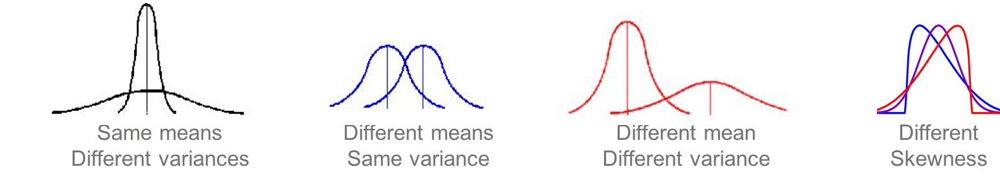
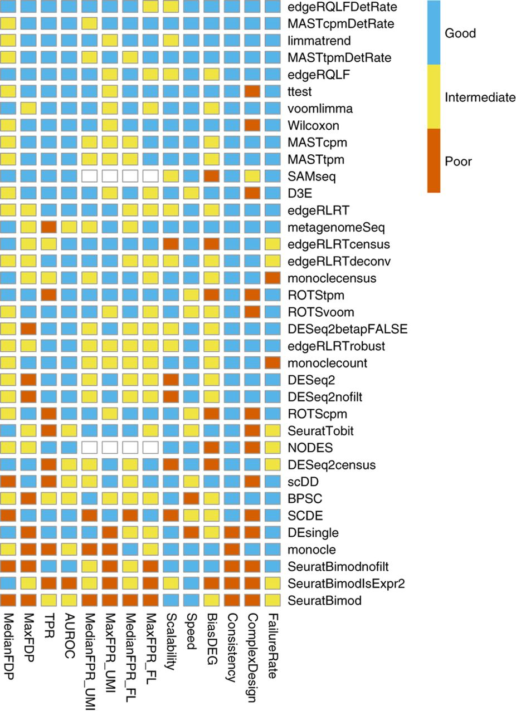
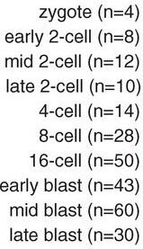

```{r setup, include=FALSE}
knitr::opts_chunk$set(echo = TRUE, message=FALSE, warning=FALSE)
```


# General info

**Course Material and code on github**

https://github.com/fmicompbio/SIB_scRNA-seq_Tutorial_2018/


**Access to the FMI rstudio server**

Login and navigate to tutorial directory. On your browser type: 

http://rstudio-ext.fmi.ch

After logging in with your credentials switch working directory by typing:

```{r Switch to tutorial directory, eval=FALSE}
# Absolute path to SIB_scRNA-seq_Tutorial_2018 repository in the the FMT ext machine
setwd("/home/radmin/SIB_scRNA-seq_Tutorial_2018/") 
```
```{r R libs, eval=TRUE}
# Add R library files 
.libPaths(c("/home/radmin/R/x86_64-redhat-linux-gnu-library/3.5",.libPaths()))
```


From here on you can run the turorial code by copying and pasting on your console.
Alternatively you could File -> File Open -> Tutorial_day2.rmd and execute the code directly from the file.


Finally we will also load a few packages and functions that will be used during the training:
```{r source_helper_functions, message=FALSE}
#PATH="/home/radmin/SIB_scRNA-seq_Tutorial_2018/" #Abs Path to ECCB repo in the the ext-fmi machine
PATH=""
source(paste(PATH, "helper_functions.R",sep=""))
```


```{r read_worksapce_image, message=FALSE}
DataList <- readRDS("data/2ndDay_DataList.rds")
clean_anno=DataList$clean_anno
clean_norm_umi_counts=DataList$clean_norm_umi_counts
endog=DataList$endog
griph_res=DataList$griph_res
PCA_Sel=DataList$PCA_Sel
```


# Analysis of differential gene expression

## Testing for differences in mean Gene expression estimates

* Single cell experiments generally have a much larger number of samples (i.e. cells) for each group compared to bulk RNA-seq. This enables us to compare different properties of the count distributions founf in cell subpopulations. So, in addition to comparing location estimates for gene expression (e.g means, medians), we can test for differences in dispersion, skewness or overall distribution for individual genes:
  
  
  


* However, when compared to bulk RNAseq profiles, single cell measurements have a high dropout rates relative to the non-zero read counts.

```{r rnbiom, message=FALSE}
set.seed(1)
hist(rnbinom(1000, mu=10, size=100), 
     col="grey50", 
     xlab="Read Counts", 
     main="Negative Binomial")
```

```{r zirnbiom, message=FALSE}
d = 0.5;
counts <- rnbinom(1000, mu=10, size=100);
counts[runif(1000) < d] = 0;
hist(counts, 
     col="grey50", 
     xlab="Read Counts", 
     main="Zero-inflated NB");
```

* For differential expression, we will look at Wilcox Rank Sum Test, Kolmogorov–Smirnov two sample test, and two methods proposed for zero-inflated negative binomial models: [*MAST*](https://bioconductor.org/packages/release/bioc/html/MAST.html) and  [*SCDE*](http://bioconductor.org/packages/release/bioc/html/scde.html).

* For coprehensive comparison of differential gene expression analyses of scRNAseq data:
[*Bias, robustness and scalability in single-cell differential expression analysis*](https://www.nature.com/articles/nmeth.4612)




To keep things simple we first subset the dat to Here we perform differentail expression between individual B and C

```{r de_get_data, message=FALSE}
# Cell Filter
keep <- clean_anno[,1] == "B" | clean_anno[,1] == "C"
group <- clean_anno[keep,1]
batch <- clean_anno[keep,4]

# Gene Filter: expressed in at least 6 cells
gkeep <- rowSums(clean_norm_umi_counts[,keep] > 0) > 5 &
  rownames(clean_norm_umi_counts) %in% endog;
counts <- clean_norm_umi_counts[gkeep,keep]
```

### Wilcoxon Rank Sum Test

Often described as the non-parametric version of the two-sample t-test, Wilcoxon Rank Sum Test assumes that the two samples are independent of one another, and the two populations have equal variance or spread. It does NOT assume that two populations are normally distributed. The magnitude of difference in means between groups C and B represents the fold change.

```{r Wilcox, message=FALSE}
# To speed up analyses we select a random set of 1000 endogenous genes
set.seed(1)
gkeep=sample(endog,1000)
counts1 <- clean_norm_umi_counts[gkeep, keep]
dim(counts1)

W_p_val <- sapply(
    X = 1:nrow(counts1),
    FUN = function(x) {
      return(wilcox.test(counts1[x, ] ~ group)$p.value)
    }
  )
W_p_val <- p.adjust(W_p_val,method = "BH")
names(W_p_val)=rownames(counts1)
summary(W_p_val)

# Select the gene with lowest W_p_val
selGene <- names(W_p_val)[order(W_p_val)][1]
plotLVis(griph_res, 
         fill.type = clean_norm_umi_counts[selGene,], 
         mark.type = clean_anno[,1])
```
The griph plot above shows the expression of gene with lowest p-value for our limited comparison. 


## Kolmogorov–Smirnov test 

The two-sample Kolmogorov–Smirnov test is one of the most useful and general nonparametric methods for comparing two samples, as it is sensitive to differences in both location and shape of the empirical cumulative distribution functions of the two samples.

```{r KStest, message=FALSE}
# We will use again the submsampled count matrix (count1) that contains counts for 1000 genes in order to speed up calculations:

KS_p_val <- sapply(
    X = 1:nrow(counts1),
    FUN = function(x) {
      return(suppressWarnings(
        ks.test(counts1[x,group=="B"],
                counts1[x,group=="C"]))$p.value)
    }
  )
KS_p_val <- p.adjust(KS_p_val,method = "BH")
names(KS_p_val)=rownames(counts1)
summary(KS_p_val)

# Select the gene with low KSp_val but NOT DGE W_pval:
KS_p_val.filter=KS_p_val[W_p_val > 0.01 & !isNA(W_p_val)]
selGene <- names(KS_p_val.filter)[order(KS_p_val.filter )][1]
plotLVis(griph_res, fill.type = clean_norm_umi_counts[selGene,], mark.type = clean_anno[,1])
```
The griph plot above shows the expression of gene with lowest p-value for our limited comparison. 


### MAST
MAST is based on a zero-inflated negative binomial model. It tests for differential expression using a hurdle model to combine tests of discrete (0 vs not zero) and continuous (non-zero values) aspects of gene expression. Again this uses a linear modelling framework to enable complex models to be considered.

We'll fit a hurdle model, modeling the condition and cngeneson factor (NODG), thus adjusting for the cellular detection rate. In order to have more interpretable coefficients, we'll set the reference level of the factor to be the "B" cells.

Since the processing time of these steps can take minutes to hours depending on the number of cells, we will use some precomputed data in the following analyses.

```{r MAST1, message=FALSE}
library(MAST)
fData <- data.frame(names=rownames(counts))
rownames(fData) <- rownames(counts)
cData <- data.frame(cond=group)
rownames(cData) <- colnames(counts)

obj <- FromMatrix(as.matrix(log2(counts+1)), cData, fData)
colData(obj)$cngeneson <- scale(colSums(assay(obj)>0))
cond <- relevel(colData(obj)$cond,"B")
colData(obj)$cond <- cond

# Model expression as function of condition & number of detected genes
# **************** DON'T RUN THIS
# zlmCond <- zlm(~cond + cngeneson, obj) 
# saveRDS(zlmCond,paste0(PATH,"data/zlmCond.rds"))

# **************** Load pre-computed data
zlmCond <- readRDS(paste0(PATH,"data/zlmCond.rds"))
```

We could run a likelihood ratio test here, testing for differences when we drop the condition factor. Note that any arbitrary contrast matrix can be tested here, and specified either using a matrix or syntactically.

```{r MAST2, message=FALSE}
# **************** DON'T RUN THIS
#summaryCond <- summary(zlmCond, doLRT="condC")
#saveRDS(summaryCond,paste0(PATH,"data/summaryCond.rds"))

# **************** Load pre-computed data
summaryCond <- readRDS(paste0(PATH,"data/summaryCond.rds"))
summaryDt   <- summaryCond$datatable

# Merge hurdle P values and logFC coefficients
fcHurdle <- merge(
  summaryDt[contrast=='condC' & component=='H',.
            (primerid, `Pr(>Chisq)`)], 
  summaryDt[contrast=='condC' & component=='logFC', 
            .(primerid, coef, ci.hi, ci.lo)], 
  by='primerid')

fcHurdle[,fdr:=p.adjust(`Pr(>Chisq)`, 'fdr')]

fcHurdleSig <- fcHurdle[fdr<.05 & abs(coef)>log2(2)]
dim(fcHurdleSig)
data.table::setorder(fcHurdleSig, fdr)
head(fcHurdleSig)
```


## Gene Set Enrichment Analysis

MAST uses a competitive gene set enrichment test, in which a contrast (hurdle model coefficient) from various gene sets of interest is compared to the background, accounting for the intergene correlation of the module coefficient.

To estimate the intergene correlation of the contrast, MAST uses bootstrapping. Cells are sampled with replacement a number of times and it refits the model. The bootstrapping can be slow (DON'T RUN the following code).

```{r MAST_GSEA_1, message=FALSE, eval=TRUE}
# Load Hallmark Gene Set (Hs.H) from MSigDB
load(paste0(PATH,"data/human_H_v5p2.rdata")) 
names(Hs.H) <- gsub("HALLMARK_","",names(Hs.H))
tmp <- select(org.Hs.eg.db, keys=unique(unlist(Hs.H)), columns=c("ENSEMBL"), keytype="ENTREZID")
Hs.H <- lapply(Hs.H, function(x) as.character(tmp[match(x,tmp[,"ENTREZID"]),"ENSEMBL"]))

sets_indices <- limma::ids2indices(Hs.H, rownames(counts))

# Only keep modules with at least 5 genes
sets_indices <- sets_indices[sapply(sets_indices, length) >= 5]

# **************** DON'T RUN THIS: processing time (5+ hrs) 
# Bootstrap, resampling cells, R should be set to >50
# boots <- bootVcov1(zlmCond, R=70)
# saveRDS(boots,paste0(PATH,"data/boots.rds"))
# boots <- readRDS(paste0(PATH,"data/boots.rds"))
# gsea <- gseaAfterBoot(zlmCond, boots, sets_indices, CoefficientHypothesis("condC")) 
# saveRDS(gsea,paste0(PATH,"data/gsea.rds"))
# **************** Load pre-computed data
gsea <- readRDS(paste0(PATH,"data/gsea.rds"))

z_stat_comb <- summary(gsea, testType='normal')
head(z_stat_comb)
```
The summary method returns a data.table with columns giving discrete and continuous Z-scores (disc_Z and cont_Z) and P-values testing if the average coefficient in the gene set differs from the average coefficient outside the set. A combined P-value (using Stouffer's method) is given in column combined_P. The effect sizes (difference in average regression coefficients) is given in effect_disc and effect_cont. For the discrete component this gives, for example, the difference in the average odds of expression in the set vs outside the set.

```{r MAST_GSEA_2, message=FALSE, eval=TRUE}
sigModules <- z_stat_comb[combined_adj<.05]
gseaTable <- data.table::melt(
  sigModules[,.(set, disc_Z, cont_Z, combined_Z)], 
  id.vars='set')
ggplot(gseaTable, aes(y=set, x=variable, fill=value)) + 
  geom_raster() + 
  scale_fill_distiller(palette="PiYG")
```


## SCDE 
SCDE is the first single-cell specific DE method. It fits a zero-inflated negative binomial model to expression data using Bayesian statistics. The usage below tests for differences in mean expression of individual genes across groups but recent versions include methods to test for differences in mean expression or dispersion of groups of genes, usually representing a pathway.

```{r SCDE, message=FALSE, eval=FALSE}
# **************** DON'T RUN THIS: processing time (>10 hrs) 
library(scde)
cnts <- apply(counts, 2, function(x) { 
  storage.mode(x) <- 'integer'; return(x) 
  })
names(group) <- 1:length(group)
colnames(cnts) <- 1:length(group)

# Fitting error models
o.ifm <- scde.error.models(
  counts = cnts, groups = group, n.cores = 1, 
  threshold.segmentation = TRUE, save.crossfit.plots = FALSE, 
  save.model.plots = FALSE, verbose = 0, min.size.entries = 2)

# Remove particularly poor cells
valid.cells <- o.ifm$corr.a > 0
o.ifm <- o.ifm[valid.cells, ]

# Define an expression magnitude prior for the genes
priors <- scde.expression.prior(
  models = o.ifm, counts = cnts, 
  length.out = 400, show.plot = FALSE )

# Testing for differential expression
resSCDE <- scde.expression.difference(
  o.ifm, cnts, priors, groups = group, 
  n.randomizations = 100, n.cores = 1, verbose = 0)

# Top upregulated genes (tail would show top downregulated ones)
head(resSCDE[order(resSCDE$Z, decreasing  =  TRUE), ])

# Convert Z-scores into 2-tailed p-values
pVals <- pnorm(abs(resSCDE$cZ), lower.tail = FALSE) * 2
pVals <- p.adjust(pVals, method = "fdr")

# Correcting for batch effects
resSCDE.batch <- scde.expression.difference(
  o.ifm, cnts, priors, groups = group, batch = batch, 
  n.randomizations = 100, n.cores = 1, 
  return.posteriors = TRUE, verbose = 1)

```


# Pseudotime Analyses

What is pseudotime?

* Pseudotime is an abstract unit of progress.

* Pseudotime analyses is required when one wants to study a process where cells change continuously, e.g. differentiation processes during development, changes in cells over a time period following a stimulus.

* Simply put, distance between a cell and the start of the trajectory, measured along the shortest path.

* The trajectory's total length is defined in terms of the total amount of transcriptional change that a cell undergoes as it moves from the starting state to the end state.


Why do we need pseudotime analyses?

* To extract RNA, cells need to be lysed. So we cannot monitor gene expression levels in individual cell over time.

* By sampling at multiple time-points, we can obtain snapshots of the gene expression profiles.

* In many biological processes, cells do not progress in perfect synchrony. Some of the cells will proceed faster along the differentiation than others.

* Instead of tracking changes in expression as a function of time, we can track underlying developmental trajectories as a function of progress along the trajectory - which we call pseudotime.


Which methods are suitable to construct these trajectories?

* Today we will use 2 methods: [*Monocle*](http://cole-trapnell-lab.github.io/monocle-release/) and [*Destiny*](https://bioconductor.org/packages/release/bioc/html/destiny.html).

* For more comprehensive overview of methods suiyable for trajectory recontruction, refer to [*Cannoodt et al, 2016*](https://www.ncbi.nlm.nih.gov/pubmed/27682842)


What data will we use?

* [*Deng et al 2014*](https://www.ncbi.nlm.nih.gov/pubmed/24408435) dataset consiting of 268 cells from 10 different time-points of early mouse development.


* Strictly speaking, there is no need for pseudotime alignment in this case as the cell labels provide information about the development trajectory. 

* We will use the labels to establish a ground truth to evaluate and compare the different methods.


The data has been preprocessed and saved as a *SingleCellExperiment* object. The cells are annotated with cell types identified in the original publication (column cell_type2 in the colData slot).

```{r }
# Read in Deng data
deng <- readRDS("data/deng/deng-reads.rds")
deng
```


Let's look at the cell type annotation:
  
```{r }
deng$cell_type2 <- factor(
  deng$cell_type2,
  levels = c("zy", "early2cell", "mid2cell", "late2cell", 
             "4cell", "8cell", "16cell", 
             "earlyblast", "midblast", "lateblast"))
cellLabels <- deng$cell_type2
deng.counts <- counts(deng)
deng.counts <- t(t(deng.counts) / colSums(deng.counts) * 1e6)
colnames(deng.counts) <- cellLabels
```


Let us take a first look at the Deng data, without yet applying sophisticated pseudotime methods. As the plot below shows, simple PCA does a very good job of displaying the structure in these data. It is only once we reach the blast cell types (*earlyblast*, *midblast*, *lateblast*) that PCA struggles to separate the distinct cell types.

```{r PCA_selection_plot1}
pc <- prcomp(t(logcounts(deng)))
datt=data.frame(cellLabels=cellLabels,PCA=pc$x[,1:2])  
ggplot(datt,aes(x=PCA.PC1,y=PCA.PC2,color=cellLabels)) + 
  geom_point(size=4,alpha=0.8)
```


## Monocle (Minimum spanning trees)

Monocle builds a minimum spanning tree on a reduced dimension representation of the cells to connect all cells. Monocle then identifies the longest path in this tree to determine pseudotime. If the data contains diverging trajectories (i.e. one cell type differentiates into two different cell-types), monocle can identify these. Each of the resulting forked paths is defined as a separate cell state. Unfortunately, Monocle does not work when all the genes are used, so we must carry out feature selection. So first, we use select highly variable genes:

```{r monocle1, eval=FALSE}
# Select highly variable genes
genes_keep <- select_variable_genes(deng.counts,0.25)
genes_keep <- 1:dim(deng.counts)[1]
d <- deng.counts[genes_keep, ]
d <- d[!duplicated(rownames(d)), ]

# Running monocle
colnames(d) <- 1:ncol(d)
geneNames <- rownames(d)
rownames(d) <- 1:nrow(d)
pd <- data.frame(timepoint = cellLabels)
pd <- new("AnnotatedDataFrame", data=pd)
fd <- data.frame(gene_short_name = geneNames)
fd <- new("AnnotatedDataFrame", data=fd)

# store the ordering on cells
dCellData <- newCellDataSet(d, phenoData = pd, 
                            featureData = fd, 
                            expressionFamily = tobit())
dCellData <- setOrderingFilter(dCellData, genes_keep)
dCellData <- estimateSizeFactors(dCellData)
dCellDataSet <- reduceDimension(dCellData, pseudo_expr = 1)
dCellDataSet <- orderCells(dCellDataSet, reverse = FALSE)
saveRDS(dCellDataSet,"data/monocle.RDS")
```

```{r monocle1saved, eval=TRUE, echo=FALSE}
dCellDataSet <- readRDS("data/monocle.RDS")
```


Let's look at the trajectory with inferred states:

```{r monocle_plot_by_state}
plot_cell_trajectory(dCellDataSet, color_by = "State")
```


Let's look at the trajectory with known timepoints:

```{r monocle_plot_by_timepoint}
plot_cell_trajectory(dCellDataSet, color_by = "timepoint")
```


Let's cells along monocole pseudotime vs timepoint

```{r monocle2}
pseudotime_monocle <- data.frame( 
  Timepoint = phenoData(dCellDataSet)$timepoint,
  pseudotime = phenoData(dCellDataSet)$Pseudotime,
  State = phenoData(dCellDataSet)$State
)
rownames(pseudotime_monocle) <- 1:ncol(dCellDataSet)
pseudotime_order_monocle <-
  rownames(pseudotime_monocle[order(pseudotime_monocle$pseudotime), ])

deng$pseudotime_monocle <- pseudotime_monocle$pseudotime
ggplot(as.data.frame(colData(deng)), 
       aes(x = pseudotime_monocle, 
           y = cell_type2, colour = cell_type2)) +
  geom_quasirandom(groupOnX = FALSE) +
  theme_classic() +
  xlab("monocle pseudotime") + ylab("Timepoint") +
  ggtitle("Cells ordered by monocle pseudotime")
```


## Destiny (Diffusion Maps)

Diffusion maps are a spectral method for non-linear dimension reduction introduced by [*Coifman et al. 2005*](http://www.pnas.org/content/102/21/7426). They are based on a distance metric (diffusion distance) which is conceptually relevant to how differentiating cells follow noisy diffusion-like dynamics, moving from a pluripotent state towards more differentiated states. 

There are multile implementations diffusion maps in R, including package [*Destiny*](https://bioconductor.org/packages/release/bioc/html/destiny.html). The function `DiffusionMap` in package `Destiny` is suited for analyzing large single-cell gene expression data from time-course experiments (up to 300,000 cells)

```{r Destiny1}
deng.counts <- logcounts(deng)
colnames(deng.counts) <- cellLabels
dm <- DiffusionMap(t(deng.counts))

tmp <- data.frame(DC1 = eigenvectors(dm)[,1],
                  DC2 = eigenvectors(dm)[,2],
                  Timepoint = deng$cell_type2)
ggplot(tmp, aes(x = DC1, y = DC2, colour = Timepoint)) +
  geom_point() + #scale_color_tableau() + 
  xlab("Diffusion component 1") + 
  ylab("Diffusion component 2") +
  theme_classic()
```


Let's cells along destiny pseudotime vs timepoint


```{r Destiny2}
deng$pseudotime_diffusionmap <- rank(eigenvectors(dm)[,1])
ggplot(as.data.frame(colData(deng)), 
       aes(x = pseudotime_diffusionmap, 
           y = cell_type2, colour = cell_type2)) +
  geom_quasirandom(groupOnX = FALSE) +
  theme_classic() +
  xlab("Diffusion map pseudotime (first diffusion map component)") +
  ylab("Timepoint") +
  ggtitle("Cells ordered by diffusion map pseudotime")
```


# Data Structures for Single Cell Experiments

## SingleCellEXperiment 

The SingleCellExperiment class (http://bioconductor.org/packages/release/bioc/vignettes/SingleCellExperiment/) is a light-weight container for single-cell genomics data. It extends the RangedSummarizedExperiment class and follows similar conventions, i.e., rows should represent features (genes, transcripts, genomic regions) and columns should represent cells. In addition to the slots already present in the RangedSummarizedExperiment, the SingleCellExperiment class contains:

   + int_elementMetadata, to hold internal metadata for each row.
   + int_colData, to hold internal metadata for each column.
   + int_metadata, to hold internal metadata for the entire object.
   + reducedDims, to hold dimensionality reduction results.

```{r SCE}   
sce <- SingleCellExperiment(assays = list(counts = clean_norm_umi_counts, logcounts=log2(clean_norm_umi_counts+1)))
#Specify spike ins
isSpike(sce, "ERCC") <- grepl("^ERCC-", rownames(sce))
sce
table(isSpike(sce, "ERCC"))
spikeNames(sce)

sizeFactors(sce) <- colSums(assay(sce))
head(sizeFactors(sce))
     
#Add low dimensional representations:
reducedDims(sce) <- list(LVis=griph_res$plotLVis)
reducedDims(sce)
head(reducedDim(sce, "LVis")[,1:2])

```


## Sparse Matrices
The main idea behind sparse matrix representations, is that if your data is sparse, i.e., there are many zero entries in your data, then a naive data.frame or matrix will consume memory for all these zeroes. If, however, you have many recurring zeroes, it is more efficient to save only the non-zero entries.
In addition to memory benefits sparse matrix representations come with significant computational speed benefits. Several matrix operations have specific implementations that take advantage of the sparse matrix representation to speed-up calculations.
The sparse matrix represenation that we will discuss comes from the Matrix package:
https://cran.r-project.org/web/packages/Matrix/index.html


```{r SparseMatrix}  
clean_norm_umi_counts.sparse <- Matrix(clean_norm_umi_counts,sparse=TRUE)

head(clean_norm_umi_counts.sparse[,1:4])

nnzero(clean_norm_umi_counts.sparse) #Number of non zero elements

# "Compression Level"
length(clean_norm_umi_counts)/nnzero(clean_norm_umi_counts.sparse) 
as.numeric(object.size(clean_norm_umi_counts))/as.numeric(object.size(clean_norm_umi_counts.sparse))

# Calculation speed-ups
system.time(sapply(1:100, function(x){ sum(clean_norm_umi_counts)  } )  )
system.time(sapply(1:100, function(x){ sum(clean_norm_umi_counts.sparse)  } )  )


```


# Closing remarks and additional resources

There are (too) many topics and issues related to SC-sequencing that go beyond the timing and scope of this tutorial and were thus left untouched. Single-cell sequencing technologies, and perhaps more-so the computational tools for the preprocessing and analysis of the resulting data are still in a state of flux. What is more important, the diversity of SC-technologies and SC-based applications has been increasing at an accelerated rate and will keep doing so for the foreseeable future.  

Any course aiming to cover the expansive landscape of SC-sequencing technologies, computational tools and applications would likely fall short of its mark (all the more so for a 1-day tutorial!). Instead we aimed to convey some of the data characteristics, computational challenges and principles that are commonplace/generalize well to many SC-sequencing applications. 

There are, however, a number of topics that we feel can be of general interest which we could not fit in the context of this tutorial and should not be left unmentioned. 
In this last section we tried to list these topics and provide links to online material for those wishing to dig into them:


1. A very comprehensive page with links to a large number of available software, tutorials, apps and papers:
  + <https://github.com/seandavi/awesome-single-cell>


2. Experimental design, batch effects, comparison of protocols and analysis workflows:
  + <http://www.cell.com/cell/abstract/S0092-8674(15)01353-7>
  + <https://genomebiology.biomedcentral.com/articles/10.1186/s13059-016-0927-y>
  + <http://www.nature.com/nmeth/journal/v14/n4/abs/nmeth.4220.html>
  + <http://www.nature.com/nbt/journal/v34/n11/full/nbt.3721.html>
  + <https://www.ncbi.nlm.nih.gov/pmc/articles/PMC5206706/>


3. Unique molecular identifiers, UMI collapse and error correction:
  + <http://www.nature.com/nmeth/journal/v11/n2/full/nmeth.2772.html>
  + <https://github.com/CGATOxford/UMI-tools>
  + <https://hemberg-lab.github.io/scRNA.seq.course/unique-molecular-identifiers-umis.html>
  + <http://www.nature.com/nmeth/journal/v11/n6/full/nmeth.2930.html>
  + <https://www.ncbi.nlm.nih.gov/pmc/articles/PMC5206706/>


4. Data structures for SC data (and how to deal with storage/memory needs efficiently):
  + <http://peterhickey.org/2017-08-01_Peter_Hickey_JSM.pdf>
  + <https://support.10xgenomics.com/single-cell-gene-expression/software/pipelines/latest/advanced/h5_matrices>
  + <http://bioconductor.org/packages/release/bioc/html/HDF5Array.html>
  + <https://bioconductor.org/packages/release/bioc/html/DelayedArray.html>


5. Inference of hierarchical structure/lineage from SC data:
  + <http://www.nature.com/nbt/journal/v35/n6/full/nbt.3854.html>
  + <https://www.nature.com/nmeth/journal/vaop/ncurrent/full/nmeth.4402.html>
  + <http://www.nature.com/nrg/journal/v18/n4/full/nrg.2016.159.html>
  + <https://www.nature.com/ni/journal/v17/n3/full/ni.3344.html>
  + <http://www.biorxiv.org/content/early/2017/04/19/128843>
  + <https://bmcbioinformatics.biomedcentral.com/articles/10.1186/s12859-016-1175-6>
  + <http://www.nature.com/nmeth/journal/v13/n10/full/nmeth.3971.html?WT.feed_name=subjects_rna-sequencing>


6. SC medical advances / applications (really too long a list to cover, only some examples):
  + <https://www.ncbi.nlm.nih.gov/pmc/articles/PMC4441954/>
  + <http://www.sciencedirect.com/science/article/pii/S073497501730040X>
  + <http://genome.cshlp.org/content/25/10/1499.full>
  + <http://www.nature.com/nri/journal/vaop/ncurrent/abs/nri.2017.76.html>
  + <http://www.nature.com/nrg/journal/v17/n8/abs/nrg.2016.67.html>
  + <https://www.illumina.com/content/dam/illumina-marketing/documents/products/research_reviews/single-cell-sequencing-research-review.pdf>


7. Single-cell-based pooled screenings:
  + <http://www.sciencedirect.com/science/article/pii/S0092867416316105>
  + <http://www.sciencedirect.com/science/article/pii/S0092867416316609>
  + <http://www.sciencedirect.com/science/article/pii/S0092867416316117>


8. Single-cell epigenomics:
  + <https://genomebiology.biomedcentral.com/articles/10.1186/s13059-016-0944-x>
  + <http://www.nature.com/nrg/journal/v16/n12/full/nrg3980.html?foxtrotcallback=true>
  + <http://databio.org/single_cell_epigenomics.html>


